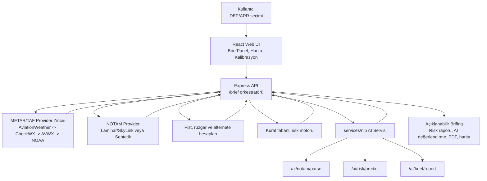
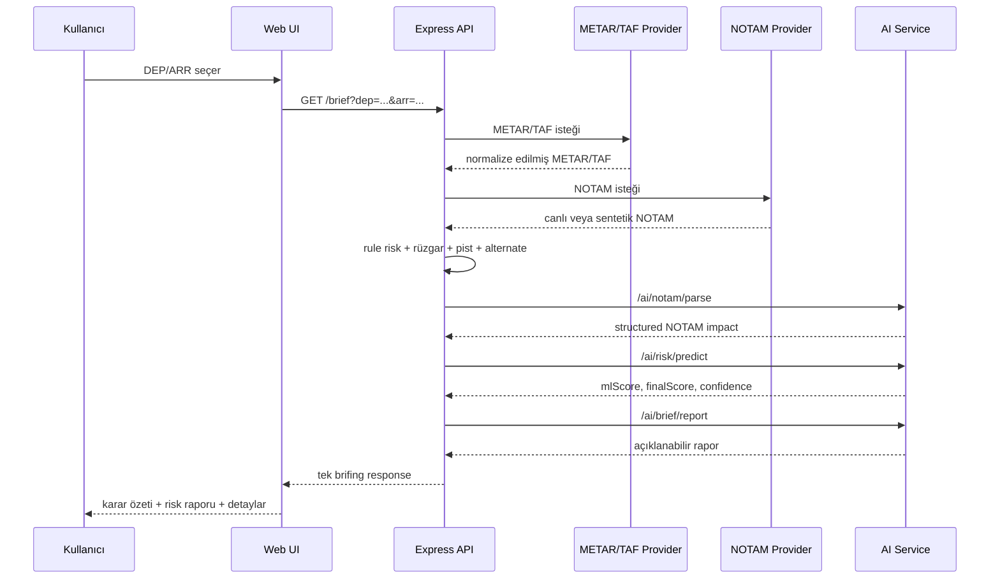
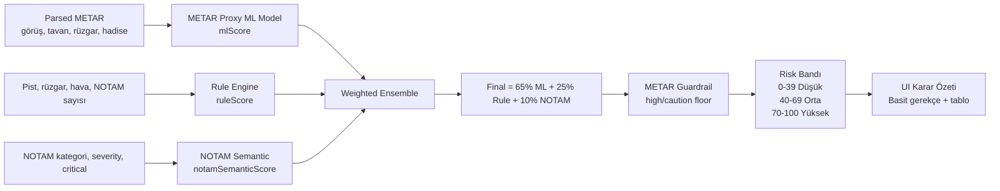
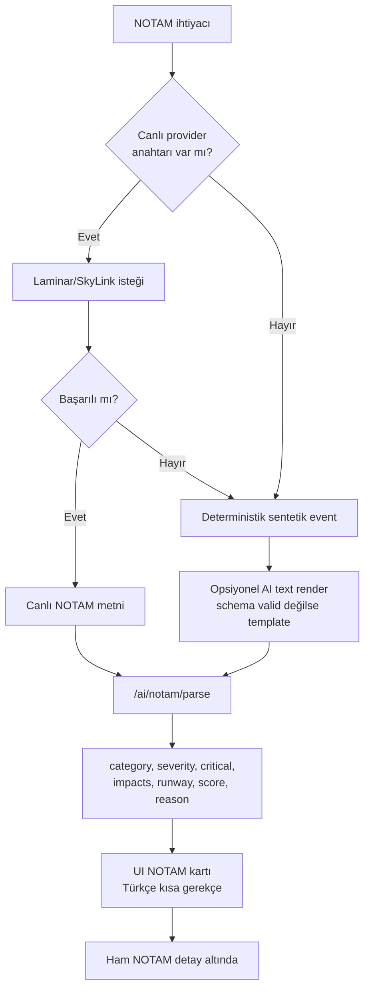
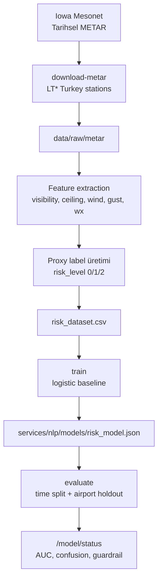
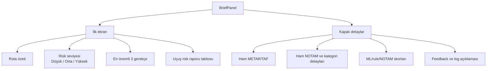
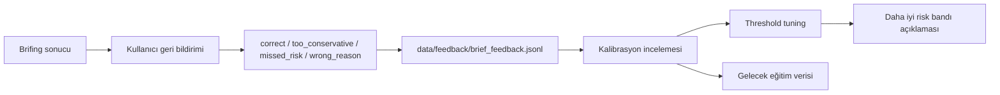

# Bitirme Tezi Artifact - Şablona Uyumlu Metin ve Mimari Şemalar

Bu artifact, `bitirmeAraRaporBahar.docx` dosyasındaki iskelete uygun şekilde hazırlanmıştır. Word şablonuna aktarırken üstteki kimlik tablosu korunmalı, aşağıdaki bölüm başlıkları aynı sırayla tablo satırlarına yerleştirilmelidir.

Gövde içinde bilerek bırakılan şema yerleri şu formatla işaretlenmiştir:

```text
(şema gelecek: Şema adı)
```

Bu satırların yerine aşağıdaki Mermaid mimari çizimleri veya sonradan hazırlanacak görseller eklenebilir.

---

## Şablon Kimlik Bilgileri

| Alan | İçerik |
|---|---|
| YILI / DÖNEMİ | 2025-2026 DERS YILI / Bahar DÖNEMİ |
| ÖĞRENCİ NO | 220290007 - 220290002 - 220290009 |
| AD SOYAD | Mete Han YILMAZ - Ahmet Selim AYTAÇ - Emre NABİKOĞLU |
| BİTİRME TEZ DANIŞMANI | Prof. Dr. Bilal ALATAŞ |
| PROJE KONUSU/BAŞLIĞI | Yapay Zeka Destekli NOTAM ve METAR/TAF Analizi ile Uçuş Risk Değerlendirme ve Karar Destek Sistemi |

---

# Word Şablonuna Kopyalanacak Metin

## Giriş (Projenin genel özeti ve ilerleme durumu)

Bu bitirme tezinde, uçuş öncesi operasyonel brifing sürecini desteklemek amacıyla geliştirilen yapay zeka destekli bir karar destek sistemi sunulmaktadır. Sistem; METAR, TAF, NOTAM, pist bilgileri, rüzgar bileşenleri, alternatif meydan önerileri ve model çıktısını tek bir akışta birleştirerek kullanıcıya anlaşılır bir uçuş risk brifingi üretir.

Çalışmanın ana hedefi, pilot, dispeçer, AIS/AIM, ATC veya resmi operasyonel otoritenin yerine geçen bir karar sistemi geliştirmek değildir. Sistem, uçuşu onaylayan veya iptal eden bir mekanizma olarak değil, uçuş öncesi kontrol edilmesi gereken risk başlıklarını açıklanabilir biçimde gösteren bir brifing asistanı olarak tasarlanmıştır.

Proje, güz döneminde oluşturulan temel veri toplama ve brifing altyapısının üzerine bahar döneminde hibrit yapay zeka, tarihsel METAR veri seti, model eğitimi, sentetik NOTAM event engine, kalibrasyon ekranı, kullanıcı geri bildirimi, loglama ve sadeleştirilmiş karar özeti katmanlarının eklenmesiyle genişletilmiştir.

Bu tez metninde sistemin ürün amacı, veri kaynakları, mimari yapısı, risk hesaplama mantığı, ML pipeline süreci, NOTAM yorumlama stratejisi, kullanıcı arayüzü kararları, test ve doğrulama bulguları ayrıntılı biçimde açıklanmaktadır. Özellikle hibrit AI yaklaşımının neden seçildiği ve sistemin hangi sınırlılıklar altında çalıştığı açıkça belirtilmiştir.

Projenin ayırt edici yönü, büyük dil modeli veya tekil bir yapay zeka bileşenine sınırsız karar yetkisi vermemesidir. Kural tabanlı motor, METAR tabanlı operasyonel proxy risk modeli ve NOTAM semantik etki sınıflandırması birlikte çalışır; LLM-benzeri rapor katmanı ise bu çıktıları okunabilir hale getirir.

(şema gelecek: Genel sistem mimarisi)

## Projenin Amacı, Kapsamı ve Sınırları

Uçuş öncesi brifing sürecinde kullanıcı çoğu zaman farklı ekranlardan veri toplamak zorundadır. METAR mevcut hava durumunu, TAF beklenen hava koşullarını, NOTAM operasyonel kısıtları, pist bilgisi meydan kullanılabilirliğini, rüzgar bileşeni ise kalkış ve iniş performansını etkiler. Bu verilerin ayrı ayrı okunması mümkündür; fakat karar destek bağlamında birlikte yorumlanmaları gerekir.

Bu projenin amacı, parçalı veri kaynaklarını tek ekranda birleştirmek ve kullanıcının risk seviyesi nedir, risk neden oluştu, hangi NOTAM kritik, hangi veri eksik ve model bu sonucu ne kadar güvenle üretti sorularına hızlı ve açıklanabilir cevap vermektir. Bu nedenle sistem yalnızca ham METAR/TAF veya NOTAM listeleyen bir araç değildir.

Kapsam dahilinde canlı METAR/TAF çekme, Türkiye LT* meydanları için tarihsel METAR veri seti oluşturma, operasyonel proxy risk modeli eğitme, sentetik NOTAM üretme, NOTAM etki sınıflandırması yapma, final risk skorunu hesaplama, risk raporu tablosu üretme ve PDF çıktı alma özellikleri yer almaktadır.

Kapsam dışında kalan en önemli başlık, gerçek operasyonel uçuş onayıdır. Sistem bir havayolu operasyon kontrol merkezi, resmi uçuş brifing servisi, meteoroloji otoritesi veya AIS/AIM sağlayıcısı değildir. Üretilen skorlar, resmi operasyonel kararın yerine geçmez; sadece dikkat edilmesi gereken başlıkları öne çıkarır.

Bu sınırın tez içinde açıkça belirtilmesi bilinçli bir tercihtir. Havacılık gibi yüksek emniyet hassasiyeti olan bir alanda yapay zekanın rolü abartılmamalıdır. Bu çalışma, sertifikalı bir karar sistemi değil, açıklanabilir hibrit AI yaklaşımının uçuş öncesi karar destek sürecine nasıl uygulanabileceğini gösteren bir prototiptir.

## Modül 1: Veri Kaynaklarının Analizi ve Genişletilmesi

Projede kullanılan veri kaynakları, sistemin doğruluğu ve sürdürülebilirliği açısından yeniden değerlendirilmiştir. İlk aşamada web sayfalarından veri çekme fikri değerlendirilmiş, ancak metar-taf.com gibi kaynakların anti-bot davranışı, izin ve kullanım koşulu belirsizliği ve HTML yapısının kırılganlığı nedeniyle üretim sağlayıcısı olarak kullanılmamasına karar verilmiştir.

METAR/TAF için birincil kaynak olarak AviationWeather Data API tercih edilmiştir. Bu kaynak, METAR ve TAF ürünlerini dünya çapında kapsama ile JSON, XML, CSV, GeoJSON ve IWXXM gibi makine tarafından işlenebilir formatlarda sunar. Ayrıca API dokümantasyonu, oran sınırlaması ve hata kodları gibi üretim ortamı açısından gerekli bilgileri içerir.

Sistem provider zinciri ile tasarlanmıştır. MET_PROVIDER=auto modunda önce AviationWeather denenir; token varsa CheckWX ve AVWX fallback olarak kullanılabilir; son aşamada NOAA text endpoint devreye girebilir. Böylece tek bir sağlayıcının geçici hatası brifing akışının tamamen durmasına neden olmaz.

Tarihsel METAR verisi için Iowa State University Iowa Environmental Mesonet ASOS/METAR arşivi kullanılmıştır. Bu arşiv Türkiye ASOS ağı dahil olmak üzere çok sayıda istasyon için geçmiş gözlem verisi indirmeye imkan verir. Model eğitimi bu geçmiş veriden oluşturulan veri seti üzerine kurulmuştur.

Meydan ve pist bilgileri için OurAirports airports.csv ve runways.csv veri setlerinden yararlanılmıştır. Bu veriler havalimanı kimliği, koordinat, pist uzunluğu, pist yönü ve meydan tipi gibi alanlar sağlar. Sistem Türkiye LT* meydanlarını filtreleyerek brifing, harita ve alternate öneri modülünde kullanır.

NOTAM tarafında canlı erişim için Laminar Data Hub, SkyLink, EUROCONTROL EAD ve uzun vadede DHMİ/EAD hattı değerlendirilmiştir. Ancak geçerli canlı API anahtarı doğrulanmadığı durumda sistem deterministik sentetik NOTAM üretir ve bunu kullanıcıya açık biçimde demo/test verisi olarak gösterir.

(şema gelecek: Veri sağlayıcı zinciri)

## Modül 2: Backend API Geliştirme

Backend tarafında Express tabanlı API, sistemin brifing orkestratörü olarak konumlandırılmıştır. Kullanıcı kalkış ve varış meydanını seçtiğinde web arayüzü `/brief` endpointine istek gönderir. API bu isteği yalnızca veri aktarma işlemi olarak değil, birden fazla veri ve model kaynağını birleştiren ana iş akışı olarak ele alır.

API önce meydan ve pist bilgilerini çözer, ardından METAR/TAF provider zincirini çalıştırır. Elde edilen veriler `providerName`, `source`, `fetchedAt`, `fallbackUsed` ve `stale` gibi metadata alanlarıyla birlikte normalize edilir. Bu alanlar sayesinde kullanıcı yalnızca veriyi değil, verinin nereden geldiğini ve fallback kullanılıp kullanılmadığını da görebilir.

NOTAM sağlayıcı modülü API içinde ayrı bir katman olarak ele alınmıştır. `NOTAM_PROVIDER=simulated` olduğunda deterministik sentetik event engine çalışır. Eğer `laminar` veya `skylink` provider seçilmişse ilgili API anahtarı ile canlı istek denenir; başarısız olursa sistem fallback davranışıyla sentetik veriye dönebilir.

API, kural tabanlı risk skorunu ürettikten sonra `services/nlp` AI servisine NOTAM parse, risk predict ve brief report istekleri gönderir. AI servisinden dönen `mlScore`, `ruleScore`, `finalScore`, `class`, `confidence`, `drivers` ve `modelVersion` alanları `/brief` response içine eklenir. AI servisi kapalıysa eski `/brief` davranışı bozulmadan kural tabanlı fallback korunur.

Backend ayrıca `/model/status`, `/feedback/summary`, `/feedback`, `/brief/logs` ve `/brief/logs/latest` endpointlerini sağlar. Bu endpointler modelin yüklü olup olmadığını, validation metriklerini, provider durumunu, kullanıcı geri bildirimlerini ve yapılan brifing sorgularını incelemek için kullanılır.

(şema gelecek: Brief request sequence)

## Modül 3: Harita Tabanlı Görselleştirme ve Canlı Trafik Katmanı

Harita modülü, sayısal brifing çıktısının mekansal karşılığını oluşturur. Kullanıcı yalnızca risk skorunu görmekle kalmaz; kalkış ve varış meydanlarını, rota çizgisini, alternate meydanları, pist yönünü ve rüzgar ilişkisini görsel olarak inceleyebilir.

Leaflet tabanlı harita yapısında DEP ve ARR markerları, rota çizgisi ve alternate meydan önerileri birlikte gösterilir. Bu yaklaşım özellikle alternate öneri sisteminin anlaşılmasını kolaylaştırır. Kullanıcı önerilen meydanın varış meydanına göre nerede bulunduğunu ve mesafenin operasyonel olarak anlamlı olup olmadığını görebilir.

Aktif pist yönü ve rüzgar oku, brifingde hesaplanan headwind/crosswind değerlerinin görsel bağlamını güçlendirir. Bir pistin sayısal yönü ve rüzgar bileşeni harita üzerinde birlikte görüldüğünde kullanıcı skoru yalnızca metin olarak değil, rota ve meydan geometrisiyle birlikte yorumlayabilir.

Canlı trafik katmanı, uygulamanın brifing deneyimini daha zengin hale getirir. Trafik verisi doğrudan final risk skorunun ana bileşeni değildir; ancak kullanıcıya operasyonel çevre hakkında ek farkındalık sağlar. Bu katman harita modülünün karar destek değerini artırır.

(şema gelecek: Harita ve alternate gösterimi)

## Modül 4: Risk Değerlendirme ve Karar Destek Mantığının Geliştirilmesi

Risk değerlendirme modülü, projenin ana karar destek çekirdeğidir. Sistem final skoru tek bir kaynaktan üretmez; ML modeli, kural tabanlı skor, NOTAM semantik skoru ve deterministic guardrail yaklaşımını birlikte kullanır. Bu nedenle skorun arkasındaki nedenler kullanıcıya açıklanabilir.

Risk bandı üç seviyeden oluşur: 0-39 düşük risk, 40-69 orta risk, 70-100 yüksek risk. Bu bantlar operasyonel onay anlamına gelmez. Düşük risk, mevcut veriye göre belirgin operasyonel sinyalin düşük olduğunu; orta risk, limit ve alternate kontrolü gerektiğini; yüksek risk ise belirgin operasyonel risk başlıklarının yeniden doğrulanması gerektiğini gösterir.

Final skor formülü şu şekilde uygulanır:

```text
finalScore = 0.65 * mlScore
           + 0.25 * ruleScore
           + 0.10 * notamSemanticScore
```

Bu dağılımda METAR tabanlı model ana ağırlığı taşır; kural motoru açıklanabilir denge sağlar; NOTAM semantik skoru ise operasyonel kısıtların final risk üzerindeki sınırlı fakat görünür etkisini temsil eder.

Guardrail mantığı, modelin açık meteorolojik riskleri düşük göstermesini engellemek için eklenmiştir. Görüş <1500 m, RVR <550 m, tavan <600 ft, wind >=30 kt, gust >=35 kt veya TS/freezing gibi sinyaller high floor üretir. Daha hafif eşikler caution floor üretir.

Kullanıcı arayüzünde riskin nedeni basit gerekçelerle gösterilir. Örneğin ARR tarafında pist yüzeyi/frenleme durumu problemli veya varış görüşü okunamadı gibi cümleler teknik skoru anlaşılır hale getirir. Teknik detay panelinde ise ML skoru, rule skoru, NOTAM skoru, guardrail ve confidence faktörleri incelenebilir.

(şema gelecek: Hibrit risk skoru ve guardrail akışı)

## Modül 5: Alternate Meydan Öneri Sisteminin Geliştirilmesi

Alternate meydan öneri sistemi, varış meydanında risk oluştuğunda kullanıcıya yakın ve uygun alternatifleri göstermek için geliştirilmiştir. Başlangıçta alternate önerilerinin kalkış çevresinde üretilmesi hatalı bir bağlam oluşturmuştur. Daha sonra sistem varış meydanı merkezli sıralama yapacak şekilde düzeltilmiştir.

Değerlendirmede mesafe, pist uzunluğu, kritik NOTAM sayısı, rüzgar uygunluğu, görüş, tavan ve hava koşulları dikkate alınır. Bu kriterlerin her biri alternate için kısa etiketlere dönüştürülür. Kullanıcı alternatif meydanın neden önerildiğini veya neden daha düşük sırada olduğunu görebilir.

Alternate önerileri tek başına resmi yedek meydan planlaması değildir. Gerçek operasyonlarda yakıt, uçak performansı, şirket prosedürü, meydan hizmetleri, gümrük/pasaport, slot ve hava trafik kısıtları gibi ek faktörler de değerlendirilmelidir. Bu sistem yalnızca ilk brifing desteği sağlar.

(şema gelecek: ARR merkezli alternate sıralama)

## Modül 6: Frontend Arayüz ve BriefPanel Geliştirmeleri

Frontend tarafında en önemli tasarım kararı, ilk ekranın sadeleştirilmesidir. İlk prototiplerde çok fazla ham METAR/TAF metni, teknik skor bileşeni, breakdown ve AI açıklaması aynı anda görünmekteydi. Bu durum kullanıcının ana sorusu olan risk neden oluştu sorusunu zorlaştırmıştır.

Son tasarımda ilk görünümde rota özeti, risk seviyesi, en önemli gerekçeler ve uçuş risk raporu tablosu yer alır. ML score, rule score, NOTAM semantic score, guardrail, model formula ve confidence faktörleri teknik detay panelinde kapalı tutulur. Böylece demo sade kalır, teknik soru gelirse derinlik korunur.

Uçuş risk raporu tablosunda kalkış görüşü, varış görüşü, kalkış tavanı, varış tavanı, yan rüzgar, TAF eğilimi, kritik NOTAM, hava modeli ve model güveni satırları bulunur. Her satır iyi, izle, risk veya eksik durumuyla gösterilir. Bu yapı kullanıcıya hangi parametrenin sorun çıkardığını hızlıca gösterir.

NOTAM kartları da yeniden düzenlenmiştir. Kartlarda ham NOTAM metni yerine önce Türkçe operasyonel özet, kritik olma gerekçesi, etkilediği pist/prosedür, etki puanı açıklaması ve ne yapılır bilgisi gösterilir. Ham metin detay altında kalır.

(şema gelecek: Brifing ekranı bilgi hiyerarşisi)

## Modül 7: PDF Brifing Modülünün Geliştirilmesi

PDF brifing modülü, ekrandaki karar destek çıktısının taşınabilir rapor haline getirilmesini sağlar. Uçuş öncesi hazırlıkta kullanıcı yalnızca ekrandaki bilgiye bakmakla kalmayabilir; raporu paylaşmak, arşivlemek veya tez demosunda çıktı olarak göstermek isteyebilir.

PDF çıktısında rota özeti, risk seviyesi, model versiyonu, hibrit skor, AI değerlendirme özeti, METAR hava değerlendirmesi, guardrail nedenleri, weather category bilgileri ve önemli NOTAM etkileri yer alır. Bu yapı, sistemin yalnızca web arayüzünden ibaret olmadığını gösterir.

PDF içinde de sistemin operasyonel otorite yerine geçmediği belirtilmelidir. Çünkü PDF çıktısı daha resmi görünebilir; bu durum yanlış güven oluşturabilir. Bu nedenle raporda karar destek amacı, veri kaynağı ve sınırlılıklar açıkça yer almalıdır.

(şema gelecek: PDF çıktı akışı)

## Modül 8: Yapay Zeka / NLP Servisi ve Hibrit Mimari

`services/nlp`, projenin AI servis katmanıdır. Bu katman `/ai/notam/parse`, `/ai/notam/render`, `/ai/risk/predict` ve `/ai/brief/report` endpointlerini sağlar. API katmanı bu servisi çağırarak NOTAM analizi, risk tahmini ve açıklanabilir rapor üretimi alır.

NOTAM parse endpointi, ham veya sentetik NOTAM metnini runway, nav, ops_hours, airspace, lighting, surface, validity ve severity gibi alanlara dönüştürür. Bu dönüşüm, kullanıcı arayüzünde kritik NOTAM gerekçelerinin kısa ve anlaşılır gösterilmesini sağlar.

Risk predict endpointi, parsed METAR/TAF, runway/wind bilgisi, NOTAM semantik özellikleri ve airport metadata üzerinden `mlScore`, `finalScore`, `class`, `confidence`, `drivers` ve `modelVersion` döndürür. Model dosyası yoksa veya AI servis hata verirse sistem fallback davranışıyla çalışır.

Brief report endpointi, tam brifing verisi ve risk sonuçları üzerinden Türkçe açıklanabilir rapor üretir. Bu rapor final skoru serbestçe belirlemez. Yalnızca verilen veri ve skorlar üzerinden kullanıcıya okunabilir yorum sunar.

(şema gelecek: AI servis mimarisi)

## Modül 9: ML Pipeline ve Model Eğitimi

ML pipeline, `tools/ml_pipeline.py` dosyası altında geliştirilmiştir. Bu pipeline tarihsel METAR indirme, canlı METAR/TAF snapshot toplama, dataset oluşturma, model eğitme ve validasyon işlemlerini içerir. Amaç, manuel olarak toplanan veriyi tekrar üretilebilir bir eğitim sürecine dönüştürmektir.

Tarihsel METAR verisi 2023-2026 aralığında Türkiye LT* istasyonları için indirilmiştir. Kullanılan komut yapısı istasyon listesini turkey olarak alabilir ve proje tarafından bilinen LT* meydanlarını otomatik okuyabilir. Rate limit hatalarına karşı pause parametresi kullanılır.

Dataset oluşturma aşamasında ham METAR kayıtlarından görüş, tavan, rüzgar, gust, hadise, precipitation, fog/mist, thunder/freezing ve benzeri özellikler çıkarılır. Bu özellikler operasyonel proxy risk etiketlerine dönüştürülür. Etiketler gerçek kaza riski değil, meteorolojik operasyonel dikkat göstergesidir.

Eğitilen ilk model üç sınıflı logistic baseline yaklaşımıyla `risk_level` hedefini öğrenir. Eğitim sonucunda 2.024.185 satırlık veri seti, 180.837 pozitif satır ve yaklaşık 0.993 ROC AUC değeri elde edilmiştir.

(şema gelecek: ML pipeline akışı)

## Modül 10: NOTAM Analizi ve Sentetik NOTAM Modeli

NOTAM modülü, canlı veri erişimi henüz doğrulanmadığı durumda sistemin demo ve test kabiliyetini korumak için deterministik sentetik event engine ile desteklenmiştir. Bu motor aynı ICAO ve aynı zaman bucket'ı için aynı NOTAM olaylarını üretir. Böylece testler ve tez demosu kararlı hale gelir.

Sentetik event engine; ICAO, airport profile, pist sayısı, pist uzunluğu, bölge tipi, major/coastal/eastern etiketleri, UTC saat, sezon ve seed bucket gibi girdilerden olay üretir. Çıktıda category, severity, critical, impacts, validFrom, validTo, affectedRunway, score ve reason bulunur.

Olay kategorileri pist kapanışı, pist kontrolü, pist yüzeyi/frenleme, seyrüsefer yardımcısı arızası, ışıklandırma bakımı, çalışma saati kısıtı, apron/taksi yolu çalışması, hava sahası faaliyeti ve hava bağlantılı uyarıları kapsar. Bu kategoriler UI'da kısa Türkçe gerekçelere çevrilir.

LLM metin katmanı, deterministik event'i NOTAM benzeri operasyonel İngilizce metne çevirebilir. Ancak severity, critical veya score değerlerini değiştiremez. Eğer LLM çıktısı schema validation'dan geçmezse deterministic template kullanılır.

(şema gelecek: NOTAM canlı/sentetik analiz pipeline)

## Modül 11: Kalibrasyon, Geri Bildirim ve Loglama

Kalibrasyon ekranı, modelin yalnızca arka planda çalışan bir dosya olmadığını, durumunun ve validasyon metriklerinin kullanıcıya gösterilebildiğini kanıtlar. `/model/status` endpointi modelin yüklü olup olmadığını, model versiyonunu, dataset satır sayısını, label dağılımını ve evaluation sonuçlarını döndürür.

Geri bildirim paneli, kullanıcıların brifing sonucunu doğru, fazla muhafazakar, kaçan risk veya yanlış neden olarak işaretleyebilmesini sağlar. Bu feedback şimdilik otomatik model eğitimine girmemektedir; ancak ileride threshold validation ve supervised calibration için yerel manuel etiket kaynağı oluşturur.

Brifing sorgularının loglanması, demo ve hata analizinde önemlidir. `data/logs/brief_queries.jsonl` dosyası hangi DEP/ARR sorgusunun hangi sonuçları döndürdüğünü incelemeye olanak verir. `/brief/logs/latest` endpointi son sorgunun hızlı kontrol edilmesini sağlar.

(şema gelecek: Feedback ve log döngüsü)

## Modül 12: Test, Doğrulama ve Kabul Senaryoları

Test süreci birim test, entegrasyon testi ve kullanıcı arayüzü senaryoları olarak ele alınmıştır. Feature extraction tarafında METAR/TAF/NOTAM girdilerinden numeric ve text özelliklerin doğru çıkarılması önemlidir. Ensemble tarafında ML, rule ve NOTAM skorlarının doğru ağırlıkla birleşmesi kontrol edilmelidir.

Fallback testi, sistemin dayanıklılığı açısından kritik kabul edilmiştir. AI servisi kapalıyken `/brief` endpointi eski davranışını bozmadan kural tabanlı sonuç döndürmelidir. Provider 204, 429 veya 500 dönerse fallback zinciri denenmelidir.

Entegrasyon senaryosunda `/brief?dep=LTFM&arr=LTAC` gibi bir istek eski alanları korurken `risk.ml` ve `aiReport` alanlarını opsiyonel olarak döndürmelidir. NOTAM parser RWY CLSD, ILS U/S, AD OPR HR gibi örnekleri doğru kategoriye ayırmalıdır.

UI senaryolarında orta/yüksek riskli rota açıldığında risk seviyesi anlaşılır görünmeli, kritik NOTAM gerekçeleri tek tek listelenmeli ve risk raporu tablosunda sorunlu parametreler kırmızı veya sarı görünmelidir.

(şema gelecek: Test ve kabul akışı)

## Kullanım Senaryoları ve Demo Akışı

Tez demosunda ilk olarak uygulama `start-flight-risk.bat` ile başlatılır. Bu dosya AI servisini 127.0.0.1:8000, API servisini localhost:4000 ve web arayüzünü 127.0.0.1:5174 üzerinde çalıştırır. Portlar doluysa duplicate servis başlatmamak için mevcut servisleri kullanma davranışı korunur.

Kullanıcı kalkış ve varış meydanını seçtiğinde sistem önce veri durumu kartını günceller. METAR/TAF provider auto, NOTAM provider simulated/hybrid, TAF snapshot zamanı ve model sağlık bilgisi ekranda görülebilir. Bu bölüm jüriye sistemin yalnızca UI değil, veri/model durumunu da izlediğini gösterir.

Orta riskli bir rota seçildiğinde sistem 40-69 bandını Orta Risk olarak açıklar. Bu sonuç uçuşu otomatik onaylamaz veya iptal etmez; limit, alternate ve güncel veri kontrolü gerektiğini belirtir. Yüksek riskte ise 70-100 bandı planın yeniden doğrulanması gerektiğini gösterir.

Kritik NOTAM bulunan senaryoda sistem genel bir kritik NOTAM var cümlesiyle yetinmez. DEP veya ARR bazında pist kapalı, pist yüzeyi/frenleme, seyrüsefer yardımcısı, ışıklandırma, hava sahası veya çalışma saati kısıtı gibi somut nedenleri listeler.

(şema gelecek: Demo akışı)

## Sonuç ve Gelecek Çalışmalar

Bu bitirme tezi kapsamında, uçuş öncesi operasyonel brifing sürecini destekleyen açıklanabilir hibrit yapay zeka tabanlı bir prototip geliştirilmiştir. Sistem METAR/TAF, NOTAM, pist/rüzgar, alternatif meydan, kural motoru, ML modeli ve AI raporlama katmanını tek akışta birleştirir.

Çalışmanın en önemli sonucu, yapay zekanın havacılık karar destek sürecinde nasıl sınırlı, açıklanabilir ve denetlenebilir bir rol üstlenebileceğini göstermesidir. Model kaza riski tahmini yapmaz; METAR tabanlı operasyonel proxy risk üretir. NOTAM katmanı operasyonel kısıtları sınıflandırır. Raporlama katmanı ise bunları kullanıcıya sade biçimde açıklar.

Sistemin mevcut sınırlılıkları vardır. Canlı Türkiye NOTAM sağlayıcısı henüz geçerli API anahtarıyla doğrulanmamıştır. TAF geçmiş veri seti ve TAF ML modeli henüz tamamlanmamıştır. Feedback etiketleri toplanmakta ancak otomatik eğitim sürecine dahil edilmemektedir.

Gelecek çalışmalarda DHMİ/EAD/EUROCONTROL veya lisanslı ticari API üzerinden gerçek NOTAM entegrasyonu doğrulanmalıdır. TAF snapshot birikimiyle TAF trend veri seti oluşturulmalı, ayrı TAF skoru eklenmeli ve feedback verileri threshold calibration sürecine dahil edilmelidir.

## KAYNAKLAR (Projede yer alan tüm kaynakların referans numaraları ile listesi)

[1] Aviation Weather Center, AviationWeather Data API, https://aviationweather.gov/data/api/.

[2] Iowa State University Iowa Environmental Mesonet, ASOS/AWOS/METAR Data Download, https://mesonet.agron.iastate.edu/request/download.phtml.

[3] OurAirports, airports.csv ve runways.csv açık veri setleri, https://ourairports.com/data/.

[4] Laminar Data Hub, NOTAM Data APIs v2, https://developer.laminardata.aero/documentation/notamdata/v2.

[5] EUROCONTROL, European AIS Database, https://www.eurocontrol.int/service/european-ais-database.

[6] FAA SWIFT/SWIM Portal, https://portal.swim.faa.gov/.

[7] React, Vite, Express, FastAPI ve scikit-learn resmi dokümantasyonları.

[8] flight-risk proje kaynak kodu, PROJECT_BRAIN.md, services/nlp, tools/ml_pipeline.py ve apps/api/apps/web modülleri.

---

# Mimari Çizimler

Bu çizimler Word dosyasına doğrudan görsel olarak aktarılabilir. Mermaid destekli bir editörde açıldığında diyagram olarak render edilir. Word'e görsel koymak istersen Mermaid Live Editor, VS Code Markdown Preview veya benzeri bir araçtan PNG/SVG olarak dışa aktarabilirsin.

## Şema 1 - Genel Sistem Mimarisi



## Şema 2 - Brief Request Sequence



## Şema 3 - Hibrit Risk Skoru



## Şema 4 - NOTAM Canlı/Sentetik Pipeline



## Şema 5 - ML Pipeline



## Şema 6 - İlk Ekran Bilgi Hiyerarşisi



## Şema 7 - Feedback ve Kalibrasyon Döngüsü


