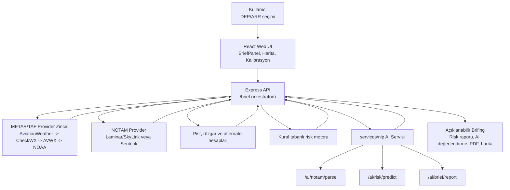
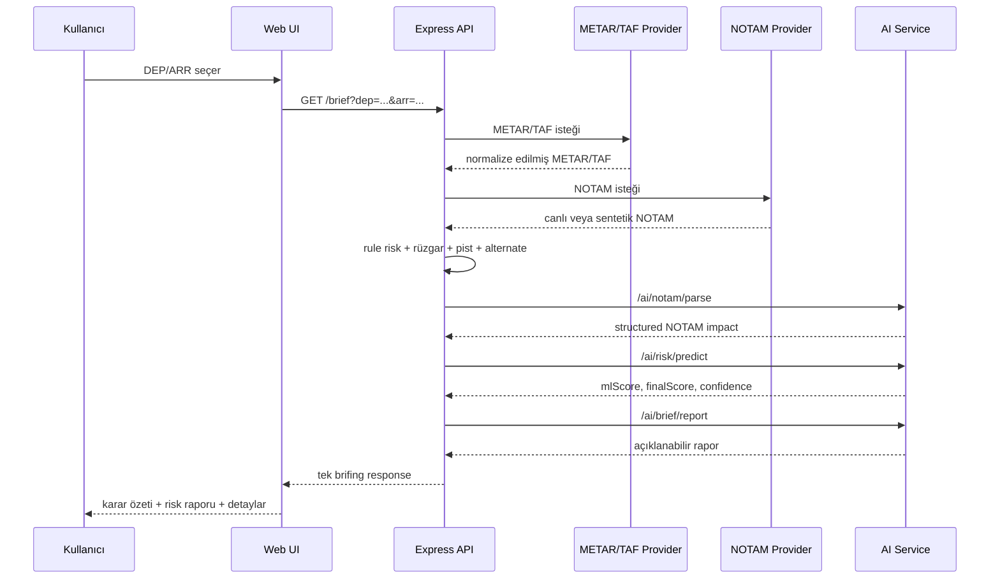
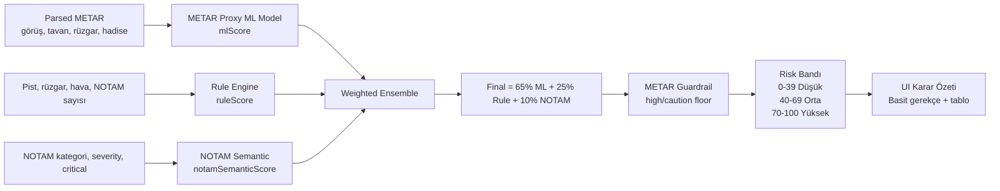
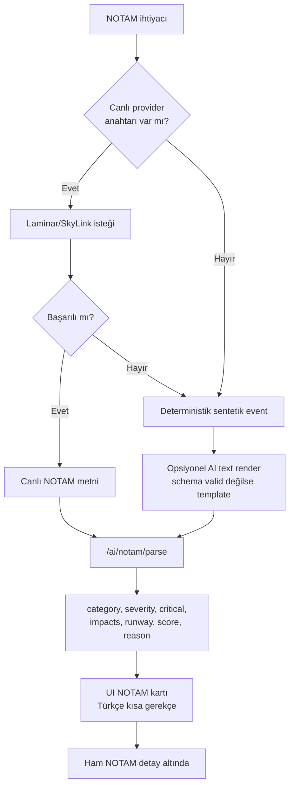
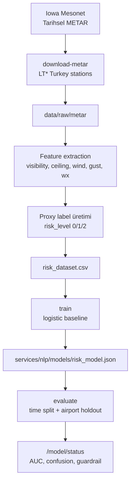
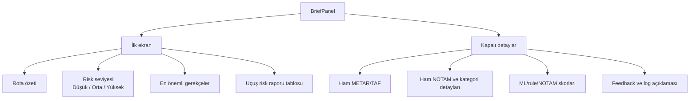
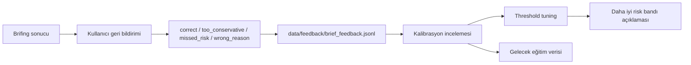

# BİTİRME TEZİ KİTAPÇIK ARTIFACT

Bu dosya, `Bitirme_Tez_guncellenmis.docx` örneğindeki tez kitapçığı yapısına göre hazırlanmıştır. Word'e aktarırken ana başlıklar `Heading 1`, alt başlıklar `Heading 2`, şekil ve tablo açıklamaları `Caption` stilinde düzenlenebilir.

Şema veya ekran görüntüsü konulacak yerler metin içinde şu şekilde bırakılmıştır:

```text
(şema gelecek: Şekil X.Y. Şema adı)
```

En altta ayrıca Mermaid formatında mimari çizimler verilmiştir.

---

# KAPAK

T.C.  
FIRAT ÜNİVERSİTESİ  
MÜHENDİSLİK FAKÜLTESİ  
YAZILIM MÜHENDİSLİĞİ BÖLÜMÜ  

Lisans Bitirme Ödevi

**YAPAY ZEKA DESTEKLİ NOTAM VE METAR/TAF ANALİZİ İLE UÇUŞ RİSK DEĞERLENDİRME VE KARAR DESTEK SİSTEMİ**

Tez Yazarları  
Mete Han YILMAZ - 220290007  
Ahmet Selim AYTAÇ - 220290002  
Emre NABİKOĞLU - 220290009  

Tez Danışmanı  
Prof. Dr. Bilal ALATAŞ  

2026  
ELAZIĞ

---

# ÖZET

Bu bitirme tezinde, uçuş öncesi operasyonel brifing sürecini desteklemek amacıyla geliştirilen hibrit yapay zeka tabanlı bir karar destek sistemi sunulmaktadır. Sistem; METAR, TAF, NOTAM, pist bilgisi, rüzgar bileşenleri, alternatif meydan önerileri ve makine öğrenmesi çıktısını tek bir arayüzde birleştirerek kullanıcıya açıklanabilir uçuş risk brifingi üretmektedir.

Çalışmanın temel amacı, pilot, dispeçer, hava trafik kontrol, AIS/AIM veya resmi operasyonel otoritenin yerine geçen bir karar sistemi geliştirmek değildir. Sistem, uçuşu onaylayan veya iptal eden bir mekanizma olarak değil, uçuş öncesi kontrol edilmesi gereken risk başlıklarını anlaşılır ve izlenebilir biçimde gösteren bir brifing asistanı olarak tasarlanmıştır.

Geliştirilen mimari, tek başına büyük dil modeli kullanan kapalı kutu bir yapıdan farklıdır. Kural tabanlı risk motoru, METAR geçmişinden eğitilmiş operasyonel proxy risk modeli, NOTAM semantik etki sınıflandırması ve LLM-benzeri açıklama katmanı birlikte çalışmaktadır. Final risk skoru; ML skoru, kural skoru ve NOTAM semantik skorunun ağırlıklı birleşiminden oluşmaktadır.

Model eğitimi için Türkiye LT* meydanlarına ait tarihsel METAR kayıtları kullanılmış, TAF verisi canlı brifing ve snapshot toplama sürecinde değerlendirilmiştir. Canlı NOTAM sağlayıcısı doğrulanmadığında sistem deterministik sentetik NOTAM üretmekte ve bu veriyi kullanıcıya açık biçimde demo/test verisi olarak göstermektedir.

Sonuç olarak bu çalışma, havacılık gibi yüksek emniyet hassasiyetine sahip bir alanda yapay zekanın sınırlı, açıklanabilir ve denetlenebilir bir karar destek bileşeni olarak nasıl konumlandırılabileceğini göstermektedir.

Anahtar Kelimeler: METAR, TAF, NOTAM, hibrit yapay zeka, karar destek sistemi, uçuş brifingi, operasyonel proxy risk, açıklanabilir yapay zeka.

---

# ABSTRACT

This thesis presents a hybrid artificial intelligence assisted pre-flight briefing and operational risk-support system. The system combines METAR, TAF, NOTAM, runway information, wind components, alternate airport suggestions and machine learning outputs in a single workflow to produce an explainable flight risk briefing.

The proposed system is not designed to replace pilots, dispatchers, air traffic control, AIS/AIM services or official operational authorities. It is designed as a briefing assistant that highlights the operational topics that should be checked before flight.

The architecture does not rely on an unconstrained large language model to make safety decisions. Instead, it combines a deterministic rule engine, a METAR-based operational proxy-risk model, a semantic NOTAM impact classifier and an LLM-like reporting layer. The final risk score is produced by a weighted combination of ML, rule-based and NOTAM semantic scores.

Historical METAR records from Turkish LT* airports are used for model training. TAF is used for live briefing and snapshot collection. When live NOTAM access is not validated, the system uses deterministic synthetic NOTAM events and clearly marks them as demo/test data.

The thesis demonstrates how artificial intelligence can be positioned as a limited, explainable and auditable decision-support component in a safety-sensitive aviation briefing context.

Keywords: METAR, TAF, NOTAM, hybrid artificial intelligence, decision support system, flight briefing, operational proxy risk, explainable AI.

---

# İÇİNDEKİLER

1. ÖZET  
2. ABSTRACT  
3. ŞEKİL LİSTESİ  
4. KISALTMALAR  
5. GİRİŞ  
   5.1 Araştırmanın Motivasyonu ve Önemi  
   5.2 Problem Tanımı  
   5.3 Tezin Kapsamı ve Organizasyonu  
6. LİTERATÜR TARAMASI  
   6.1 Havacılıkta Uçuş Öncesi Brifing  
   6.2 METAR/TAF ve Meteorolojik Karar Desteği  
   6.3 NOTAM Bilgisi ve Operasyonel Kısıtlar  
   6.4 Açıklanabilir Yapay Zeka ve Hibrit Karar Destek  
7. MATERYAL VE METOT  
   7.1 Geliştirme Ortamı ve Kullanılan Teknolojiler  
   7.2 Veri Kaynakları ve Provider Zinciri  
   7.3 ML Veri Seti ve Proxy Etiket Tasarımı  
   7.4 Risk Skoru ve Guardrail Yaklaşımı  
8. SİSTEM TASARIMI VE GELİŞTİRME SÜRECİ  
   8.1 Modül 1: Veri Kaynaklarının Analizi  
   8.2 Modül 2: Backend API ve Brifing Orkestrasyonu  
   8.3 Modül 3: AI/NLP Servisi  
   8.4 Modül 4: NOTAM Analizi  
   8.5 Modül 5: ML Pipeline  
   8.6 Modül 6: Frontend ve BriefPanel  
   8.7 Modül 7: Harita, PDF, Feedback ve Kalibrasyon  
9. BULGULAR VE DEĞERLENDİRME  
10. TARTIŞMA  
11. SONUÇ VE GELECEK ÇALIŞMALAR  
12. KAYNAKÇA  
13. MİMARİ ŞEMALAR

---

# ŞEKİL LİSTESİ

Şekil 4.1. Genel sistem mimarisi ve servis katmanları  
Şekil 4.2. `/brief` endpointi üzerinden brifing üretim akışı  
Şekil 4.3. Hibrit risk skoru ve guardrail mekanizması  
Şekil 4.4. NOTAM canlı/sentetik analiz pipeline yapısı  
Şekil 4.5. METAR veri seti ve ML eğitim pipeline yapısı  
Şekil 4.6. BriefPanel bilgi hiyerarşisi  
Şekil 5.1. Model değerlendirme ve kalibrasyon döngüsü  

---

# KISALTMALAR

AI : Artificial Intelligence  
API : Application Programming Interface  
ARR : Arrival Airport  
DEP : Departure Airport  
EAD : European AIS Database  
ICAO : International Civil Aviation Organization  
IEM : Iowa Environmental Mesonet  
LLM : Large Language Model  
METAR : Meteorological Aerodrome Report  
ML : Machine Learning  
NOTAM : Notice to Airmen / Notice to Air Missions  
PDF : Portable Document Format  
RVR : Runway Visual Range  
TAF : Terminal Aerodrome Forecast  
UI : User Interface  
VFR : Visual Flight Rules  

---

# GİRİŞ

## Araştırmanın Motivasyonu ve Önemi

Uçuş öncesi hazırlık süreci, farklı veri kaynaklarının birlikte değerlendirilmesini gerektiren çok aşamalı bir süreçtir. Pilot veya operasyon planlayıcısı; METAR, TAF, NOTAM, pist bilgisi, rüzgar bileşenleri ve alternatif meydanları ayrı ayrı incelemek zorunda kalabilir. Bu kaynakların her biri kendi içinde değerlidir; ancak karar destek açısından asıl ihtiyaç bu verilerin birlikte yorumlanmasıdır.

Bu tezde geliştirilen sistem, uçuş öncesi brifing sürecindeki dağınık bilgi kaynaklarını tek bir açıklanabilir arayüz altında toplamayı amaçlamaktadır. Kullanıcıya yalnızca ham veri sunmak yerine, hangi parametrenin risk oluşturduğunu, hangi verinin eksik olduğunu ve risk skorunun hangi bileşenlerden geldiğini gösterir.

Çalışmanın önemi, yapay zekanın havacılık gibi güvenlik hassasiyeti yüksek bir alanda kontrolsüz karar verici olarak değil, sınırlı ve açıklanabilir karar destek bileşeni olarak kullanılmasını göstermesidir.

## Problem Tanımı

METAR mevcut hava durumunu, TAF beklenen meteorolojik koşulları, NOTAM ise operasyonel kısıtları ifade eder. Bu veriler ham formatta okunabilir olsa da, özellikle yoğun veya teknik içerikli olduğunda kullanıcı için hızlı yorumlama zorlaşabilir.

Örneğin görüş iyi olsa bile varış meydanında pist kapanışı veya ILS arızası bulunabilir. Benzer şekilde NOTAM tarafı sakin olsa bile düşük tavan, kuvvetli yan rüzgar veya TAF kötüleşme eğilimi uçuş öncesi planlamada ek kontrol gerektirebilir.

Bu nedenle problem yalnızca veri toplama problemi değildir. Asıl problem; verinin bağlam içinde, açıklanabilir şekilde, risk başlıklarına ayrılarak kullanıcıya sunulmasıdır.

## Tezin Kapsamı ve Organizasyonu

Bu tez kapsamında geliştirilen flight-risk sistemi; web arayüzü, Express API, AI/NLP servisi, METAR veri pipeline yapısı, sentetik NOTAM event engine, risk skoru hesaplama mantığı, PDF brifing, harita ve kalibrasyon bileşenlerinden oluşmaktadır.

Tezin devamında önce literatür ve kavramsal arka plan sunulmakta, ardından materyal-metot bölümünde kullanılan teknolojiler ve veri stratejisi açıklanmaktadır. Sistem tasarımı bölümünde modüller ayrıntılı biçimde ele alınmakta, bulgular bölümünde model ve entegrasyon çıktıları değerlendirilmektedir.

---

# LİTERATÜR TARAMASI

## Havacılıkta Uçuş Öncesi Brifing

Uçuş öncesi brifing, operasyonel karar sürecinin temel bileşenlerinden biridir. Meteorolojik durum, meydan koşulları, pist kullanılabilirliği, NOTAM kısıtları ve alternatif meydan seçenekleri bu sürecin ana girdileridir.

Geleneksel yaklaşımda bu girdiler farklı sistemlerden kontrol edilir. Modern karar destek sistemlerinde ise amaç bu verileri tek bir bağlam altında birleştirerek kullanıcıya daha hızlı ve anlaşılır bir ön değerlendirme sunmaktır.

## METAR/TAF ve Meteorolojik Karar Desteği

METAR, meydanda gözlenen meteorolojik durumu ifade eder. TAF ise belirli bir zaman aralığında terminal sahasında beklenen meteorolojik koşulları sunar. Görüş, bulut tavanı, rüzgar, gust, yağış, sis, gök gürültülü hadise ve freezing sinyalleri uçuş öncesi risk değerlendirmesinde önemlidir.

Bu projede METAR verisi tarihsel eğitim verisi olarak kullanılmış, TAF verisi ise canlı brifing ve snapshot toplama sürecinde değerlendirilmiştir. TAF için ayrı bir ML modeli henüz eğitilmemiştir; ancak TAF trend sinyalleri kural ve AI raporlama katmanında dikkate alınmaktadır.

## NOTAM Bilgisi ve Operasyonel Kısıtlar

NOTAM; pist kapanışı, seyrüsefer yardımcısı arızası, ışıklandırma çalışması, apron/taksi yolu kısıtı, hava sahası faaliyeti veya çalışma saati değişikliği gibi operasyonel bilgileri taşır.

NOTAM metinleri genellikle kısa, kodlu ve bağlama bağımlıdır. Bu nedenle ham NOTAM metni kullanıcıya sunulduğunda riskin nedeni her zaman açık olmayabilir. Projede NOTAM metni kategori, şiddet, kritik durum, etki alanı, pist/prosedür ve skor alanlarına ayrıştırılmıştır.

## Açıklanabilir Yapay Zeka ve Hibrit Karar Destek

Havacılık gibi güvenlik hassasiyeti yüksek alanlarda yapay zekanın açıklanabilir olması gerekir. Kullanıcı yalnızca skor görmek yerine, skorun hangi veri ve hangi model bileşeninden kaynaklandığını anlayabilmelidir.

Bu tezde hibrit yaklaşım seçilmiştir. Kural tabanlı motor deterministik eşikleri yakalar, ML modeli METAR geçmişinden operasyonel proxy risk öğrenir, NOTAM semantik katmanı operasyonel kısıtları sınıflandırır, LLM-benzeri raporlama katmanı ise sonucu doğal dile dönüştürür.

---

# MATERYAL VE METOT

## Geliştirme Ortamı ve Kullanılan Teknolojiler

Tablo 3.1. Proje Teknoloji Yığını

| Katman | Teknoloji | Görev |
|---|---|---|
| Web UI | React, Vite, TypeScript | Brifing ekranı, harita, kalibrasyon |
| API | Express, TypeScript | `/brief` orkestrasyonu |
| AI Servisi | Python, FastAPI yaklaşımı | NOTAM parse, risk predict, report |
| ML Pipeline | Python | METAR indirme, dataset, eğitim, validasyon |
| Veri | AviationWeather, Iowa Mesonet, OurAirports | METAR/TAF, tarihsel METAR, meydan/pist |
| Çıktı | PDF, JSONL log | Brifing raporu ve izlenebilirlik |

## Veri Kaynakları ve Provider Zinciri

Canlı METAR/TAF için birincil kaynak AviationWeather Data API olarak belirlenmiştir. CheckWX ve AVWX token varsa fallback olarak kullanılabilir. Son fallback olarak NOAA text endpoint değerlendirilebilir. Bu yapı tek bir sağlayıcıya bağımlılığı azaltır.

Tarihsel METAR eğitim verisi Iowa Mesonet ASOS/METAR arşivinden alınmıştır. `--stations turkey` seçeneği ile proje tarafından bilinen LT* meydanları otomatik okunur. Bu veri, operasyonel proxy risk etiketi oluşturmak için kullanılmıştır.

NOTAM tarafında canlı provider anahtarı olmadığında deterministik sentetik NOTAM event engine çalışır. Bu motor aynı ICAO ve aynı zaman bucket için stabil olaylar üretir. Sentetik veri UI'da açıkça demo/test verisi olarak gösterilir.

## ML Veri Seti ve Proxy Etiket Tasarımı

Model gerçek kaza riski tahmin etmez. Modelin hedefi, METAR verisinden türetilmiş operasyonel proxy risk etiketidir. Görüş düşüklüğü, tavan düşüklüğü, RVR, kuvvetli rüzgar, gust, sis, yağış, thunderstorm ve freezing gibi sinyaller etiket üretiminde kullanılır.

Eğitim sonucu 2.024.185 satırlık veri seti oluşturulmuş, üç sınıflı `risk_level` hedefiyle model eğitilmiştir. Bu yapı düşük, orta ve yüksek risk bandı ile kullanıcı arayüzünde açıklanabilir hale getirilmiştir.

## Risk Skoru ve Guardrail Yaklaşımı

Final risk skoru aşağıdaki formülle üretilir:

```text
finalScore = 0.65 * mlScore
           + 0.25 * ruleScore
           + 0.10 * notamSemanticScore
```

Guardrail yaklaşımı, açık meteorolojik risklerin model tarafından düşük gösterilmesini engeller. Görüş, RVR, tavan, wind/gust, thunderstorm ve freezing gibi eşikler high veya caution floor üretir.

(şema gelecek: Şekil 3.1. Hibrit skor ve guardrail akışı)

---

# SİSTEM TASARIMI VE GELİŞTİRME SÜRECİ

## Modül 1: Veri Kaynaklarının Analizi

Projede scraping yaklaşımı yerine provider zinciri tercih edilmiştir. metar-taf.com gibi web sayfaları manuel referans için yararlı olsa da, üretim sağlayıcısı olarak kırılgan ve izin açısından belirsizdir.

AviationWeather API canlı METAR/TAF için, Iowa Mesonet tarihsel METAR için, OurAirports ise meydan ve pist metaverisi için kullanılmıştır. NOTAM tarafında Laminar, SkyLink ve EAD uzun vadeli canlı sağlayıcı hedefleri olarak değerlendirilmiştir.

(şema gelecek: Şekil 4.1. Veri sağlayıcı zinciri)

## Modül 2: Backend API ve Brifing Orkestrasyonu

Express API, sistemin merkez orkestratörüdür. `/brief` isteği geldiğinde API; meydan/pist bilgisini çözer, METAR/TAF provider zincirini çalıştırır, NOTAM sağlayıcısını çağırır, kural tabanlı risk skorunu üretir ve AI servisine risk/report istekleri gönderir.

AI servisi kapalı olduğunda sistem tamamen bozulmaz. Kural tabanlı fallback korunur, confidence düşer ve kullanıcıya sınırlılık gösterilir.

(şema gelecek: Şekil 4.2. Brief request sequence)

## Modül 3: AI/NLP Servisi

AI servisi `/ai/notam/parse`, `/ai/risk/predict` ve `/ai/brief/report` endpointlerini sağlar. Bu servis NOTAM semantik ayrıştırması, hibrit risk tahmini ve açıklanabilir rapor üretimi için kullanılır.

LLM-benzeri raporlama katmanı final skoru serbestçe üretmez. Yalnızca ML, kural ve NOTAM analizinden gelen sonuçları kullanıcıya anlaşılır Türkçe açıklama olarak sunar.

(şema gelecek: Şekil 4.3. AI servis mimarisi)

## Modül 4: NOTAM Analizi

NOTAM modülü canlı provider varsa gerçek NOTAM verisini kullanabilir. Provider yoksa veya erişim başarısızsa sentetik event engine devreye girer. Sentetik NOTAM açıkça demo/test verisi olarak işaretlenir.

Kritik NOTAM açıklaması genel bırakılmaz. Pist kapalı, pist yüzeyi/frenleme etkisi, ILS/PAPI/VOR/GNSS etkisi, ışıklandırma bakımı, hava sahası kısıtı veya çalışma saati kısıtı gibi somut gerekçeler gösterilir.

(şema gelecek: Şekil 4.4. NOTAM canlı/sentetik pipeline)

## Modül 5: ML Pipeline

ML pipeline, tarihsel METAR verisinin indirilmesi, feature extraction, proxy etiket üretimi, model eğitimi ve validasyon adımlarından oluşur. Model artifact olarak `services/nlp/models/risk_model.json` dosyasında tutulur.

Modelin amacı kaza riski tahmini değildir. Bu model, METAR verisinden türetilmiş operasyonel hava riskini hesaplayan proxy risk modelidir.

(şema gelecek: Şekil 4.5. ML pipeline akışı)

## Modül 6: Frontend ve BriefPanel

Frontend tarafında ilk ekran sadeleştirilmiştir. Kullanıcı ilk olarak rota özeti, risk seviyesi, basit gerekçeler ve uçuş risk raporu tablosunu görür. Ham METAR/TAF, model formülü ve guardrail detayları kapalı teknik panelde kalır.

Bu yapı tez demosu için önemlidir. Jüri ilk bakışta sistemin ne yaptığını anlar; teknik soru geldiğinde model, NOTAM ve feedback detayları açılabilir.

(şema gelecek: Şekil 4.6. BriefPanel bilgi hiyerarşisi)

## Modül 7: Harita, PDF, Feedback ve Kalibrasyon

Harita modülü DEP/ARR, rota, alternate meydanlar, pist yönü ve rüzgar ilişkisini görsel olarak sunar. PDF modülü brifing çıktısını taşınabilir rapor haline getirir.

Feedback paneli kullanıcıdan doğru, fazla muhafazakar, kaçan risk veya yanlış neden etiketi alabilir. Bu veri şimdilik otomatik eğitime girmez; ancak gelecekte kalibrasyon için kullanılabilir.

(şema gelecek: Şekil 4.7. Feedback ve kalibrasyon döngüsü)

---

# BULGULAR VE DEĞERLENDİRME

## Model Eğitim Sonuçları

Tablo 5.1. METAR Proxy Risk Modeli Eğitim Özeti

| Metrik | Değer |
|---|---|
| Eğitim satırı | 2.024.185 |
| Hedef | risk_level |
| Pozitif satır | 180.837 |
| ROC AUC | 0.993052 |
| Time validation ROC AUC | 0.994854 |
| Airport holdout ROC AUC | 0.991160 |
| Guardrail false negative | 0 |

Bu sonuçlar modelin proxy etiketleri başarılı biçimde ayırabildiğini göstermektedir. Ancak bu başarı gerçek kaza riski tahmini olarak yorumlanmamalıdır. Model yalnızca METAR tabanlı operasyonel proxy risk modelidir.

## Entegrasyon Testi

Sistem `/brief?dep=LTFM&arr=LTAC` gibi rotalarda METAR/TAF, NOTAM, pist/rüzgar hesabı, kural skoru, AI risk tahmini ve açıklanabilir raporu tek response içinde döndürebilecek şekilde tasarlanmıştır.

AI servisi kapalı olduğunda kural tabanlı fallback korunur. NOTAM provider canlı değilse sentetik NOTAM demo/test verisi olarak gösterilir. Bu iki davranış sistemin dayanıklılığını artırır.

(şema gelecek: Şekil 5.1. Uçtan uca entegrasyon akışı)

## Kullanıcı Arayüzü Bulguları

İlk prototipte teknik detaylar ilk ekranda fazla görünür durumdaydı. Son düzenlemede karar özeti, basit gerekçe ve risk raporu tablosu öne çıkarılmıştır. Teknik detaylar kapalı panellere taşınmıştır.

Bu değişiklik kullanıcı deneyimini iyileştirmiştir. Kullanıcı artık risk skorunun neden oluştuğunu daha hızlı anlayabilir. Kritik NOTAM gerekçeleri de madde halinde verildiği için NOTAM skorunun anlamı daha açık hale gelmiştir.

---

# TARTIŞMA

Bu tezde önerilen hibrit mimari, tekil bir yapay zeka modelinin karar vermesi yerine farklı bileşenlerin kontrollü biçimde birlikte çalışmasını esas alır. Bu yaklaşım havacılık gibi güvenlik hassasiyeti yüksek alanlarda daha savunulabilir bir tasarım sunar.

Kural tabanlı motor açık eşikleri yakalar. ML modeli geçmiş METAR verisinden örüntü öğrenir. NOTAM semantik katmanı operasyonel kısıtları anlamlandırır. LLM-benzeri rapor katmanı ise sonuçları anlaşılır dile çevirir.

Sistemin sınırlılıkları da önemlidir. Canlı Türkiye NOTAM entegrasyonu henüz doğrulanmış API anahtarı ile test edilmemiştir. TAF geçmiş veri seti ve TAF ML modeli henüz tamamlanmamıştır. Feedback verileri toplanmakta ancak otomatik eğitim sürecine dahil edilmemektedir.

Bu sınırlılıklar sistemin değerini azaltmaz; aksine doğru konumlandırılmasını sağlar. Proje, operasyonel sertifikalı karar sistemi değil, açıklanabilir hibrit AI tabanlı uçuş öncesi karar destek prototipidir.

---

# SONUÇ VE GELECEK ÇALIŞMALAR

Bu bitirme tezinde, uçuş öncesi brifing sürecini destekleyen açıklanabilir hibrit yapay zeka tabanlı bir sistem geliştirilmiştir. Sistem METAR/TAF, NOTAM, pist/rüzgar, ML modeli, kural motoru, PDF, harita ve feedback bileşenlerini bütünleşik bir yapıda sunmaktadır.

Çalışmanın en önemli katkısı, yapay zekanın karar verici değil, açıklanabilir karar destek bileşeni olarak konumlandırılmasıdır. Final skor, ML, rule ve NOTAM semantik skorlarının birleşimiyle üretilir. LLM-benzeri katman yalnızca raporlama ve açıklama rolü üstlenir.

Gelecek çalışmalarda canlı NOTAM sağlayıcı doğrulaması, TAF geçmiş veri seti, TAF trend modeli, feedback tabanlı kalibrasyon, SHAP benzeri açıklanabilirlik araçları ve uçak tipi bazlı operasyonel limit profilleri eklenebilir.

---

# KAYNAKÇA

[1] Aviation Weather Center, AviationWeather Data API, https://aviationweather.gov/data/api/  
[2] Iowa State University Iowa Environmental Mesonet, ASOS/AWOS/METAR Data Download, https://mesonet.agron.iastate.edu/request/download.phtml  
[3] OurAirports, airports.csv ve runways.csv açık veri setleri, https://ourairports.com/data/  
[4] Laminar Data Hub, NOTAM Data APIs v2, https://developer.laminardata.aero/documentation/notamdata/v2  
[5] EUROCONTROL, European AIS Database, https://www.eurocontrol.int/service/european-ais-database  
[6] FAA SWIFT/SWIM Portal, https://portal.swim.faa.gov/  
[7] React, Vite, Express, FastAPI ve scikit-learn resmi dokümantasyonları  
[8] flight-risk proje kaynak kodu, PROJECT_BRAIN.md, services/nlp, tools/ml_pipeline.py ve apps/api/apps/web modülleri  

---

# MİMARİ ŞEMALAR

## Şema 1 - Genel Sistem Mimarisi



## Şema 2 - Brief Request Sequence



## Şema 3 - Hibrit Risk Skoru



## Şema 4 - NOTAM Canlı/Sentetik Pipeline



## Şema 5 - ML Pipeline



## Şema 6 - BriefPanel Bilgi Hiyerarşisi



## Şema 7 - Feedback ve Kalibrasyon Döngüsü


