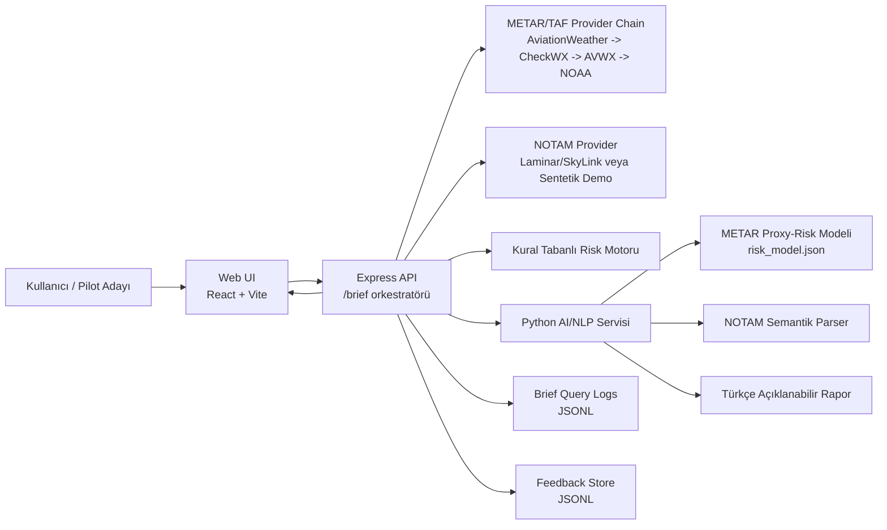
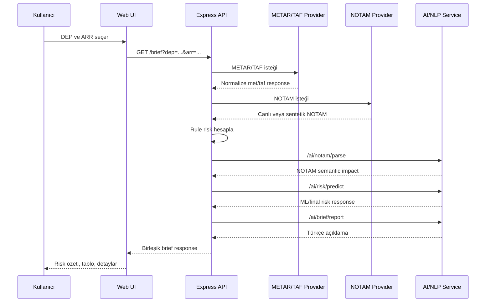
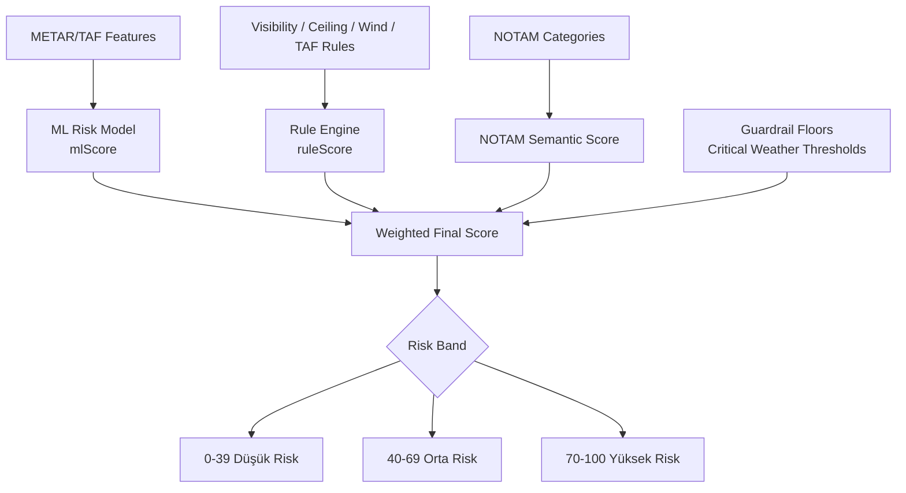
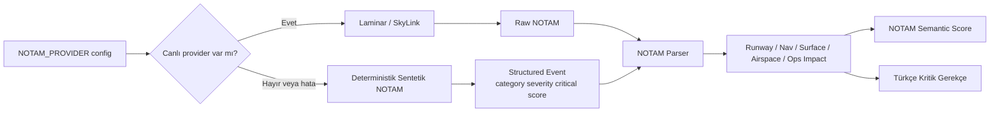
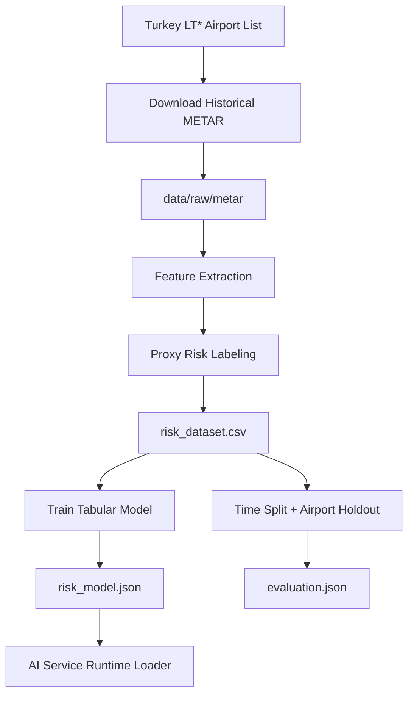
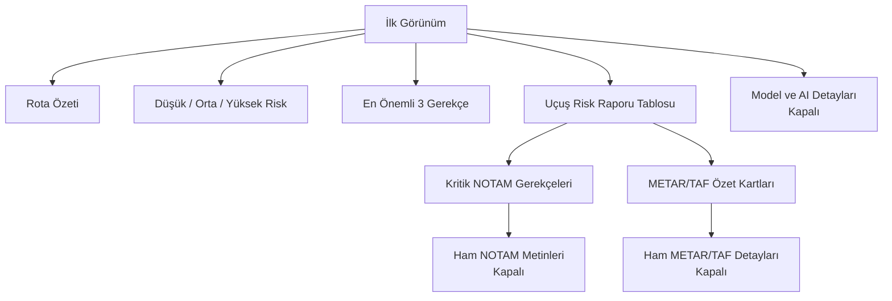
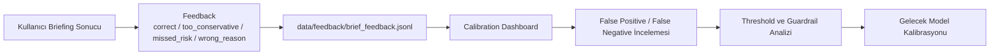

# BİTİRME TEZİ KİTAPÇIĞI ARTIFACT

Bu dosya, verilen tez kitapçığı örneğinin bölüm düzenine uygun olarak hazırlanmış geniş bitirme tezi metnidir. Word şablonuna aktarılırken kapak, içindekiler, şekil listesi, tablo listesi, sayfa numaraları ve biçimsel ayrıntılar kurumun istediği nihai formata göre düzenlenmelidir. Metin 25-50 sayfalık tez kitapçığı hacmine yaklaşacak şekilde genişletilmiş; mimari çizimler ise hem metin içinde "(şema gelecek)" yer tutucuları olarak, hem de dosyanın sonunda Mermaid artifact şeklinde verilmiştir.

---

# KAPAK

T.C.

FIRAT ÜNİVERSİTESİ

MÜHENDİSLİK FAKÜLTESİ

YAZILIM MÜHENDİSLİĞİ BÖLÜMÜ

LİSANS BİTİRME TEZİ

**YAPAY ZEKA DESTEKLİ HİBRİT UÇUŞ ÖNCESİ RİSK DEĞERLENDİRME VE BRİFİNG ASİSTANI**

Hazırlayan:

Mete [SOYAD]

Danışman:

[Unvan Ad Soyad]

ELAZIĞ - 2026

---

# ÖZET

Havacılık operasyonlarında uçuş öncesi brifing süreci, pilotun ve operasyon ekibinin meteorolojik koşulları, meydan kısıtlarını, pist durumunu, rüzgar etkisini, alternatif meydanları ve operasyonel uyarıları birlikte değerlendirdiği kritik bir hazırlık aşamasıdır. ICAO Annex 3, havacılık meteorolojik hizmetlerinin uçuş emniyeti, verimlilik ve düzenlilik için gerekli meteorolojik bilgiyi sağlamayı amaçladığını belirtir [1]. Bu süreçte METAR, TAF, NOTAM, pist bilgisi ve rüzgar bileşenleri gibi farklı veri kaynakları kullanılır. Ancak bu kaynaklar çoğu zaman teknik formatta, yoğun metin halinde ve farklı sistemlerde dağınık olarak sunulur. Bu durum özellikle hızlı karar destek ihtiyacı olan operasyon öncesi hazırlıkta bilgi yükünü artırır. Bu bitirme tezinde geliştirilen sistem, pilot veya resmi operasyon otoritesi yerine karar veren bir sistem değil; uçuş öncesi risk sinyallerini anlaşılır biçimde bir araya getiren açıklanabilir bir karar destek ve brifing asistanıdır.

Çalışmanın temel amacı, METAR/TAF meteorolojik verileri, NOTAM etkileri, pist/rüzgar hesapları, kural tabanlı risk değerlendirmesi ve makine öğrenmesi çıktısını tek bir brifing akışında birleştiren hibrit yapay zeka mimarisi tasarlamak ve prototip olarak gerçekleştirmektir. Sistem monorepo yapısında web arayüzü, Express tabanlı API orkestratörü, Python tabanlı AI/NLP servisi, veri indirme ve model eğitim pipeline'ı bileşenlerinden oluşmaktadır. Canlı METAR/TAF verileri, METAR ve TAF ürünlerini dünya çapında ham metin, JSON, XML ve benzeri biçimlerde sağlayan AviationWeather Data API üzerinden alınmaktadır [2]. Geçmiş Türkiye LT* METAR verileri, Iowa State University Iowa Environmental Mesonet ASOS/AWOS/METAR arşivinden indirilen kayıtlarla oluşturulmuş ve operasyonel proxy-risk etiketiyle eğitilen tabular makine öğrenmesi modeli; görünürlük, tavan, RVR, rüzgar, fırtına, donma ve yağış sinyalleri üzerinden meteorolojik operasyonel risk skoru üretmektedir [3]. Canlı NOTAM anahtarı bulunmadığında sistem, resmi NOTAM yerine geçmeyen demo/test amaçlı deterministik sentetik NOTAM motorunu kullanır; gerçek NOTAM/AIS verisinin merkezi ve kalite güvenceli kaynaklardan sağlanması gerektiği EUROCONTROL EAD yaklaşımıyla da uyumludur [4]. Canlı NOTAM entegrasyonu için Laminar NOTAM Data API ve SkyLink NOTAM API live-ready sağlayıcılar olarak değerlendirilmiş, meydan ve pist metadata ihtiyacı için OurAirports açık veri sözlüğünden yararlanılmıştır [5], [6], [7]. Bu model çıktısı, kural tabanlı skor ve NOTAM semantik skoru ile ağırlıklı olarak birleştirilmekte; guardrail kuralları ile kritik meteorolojik eşikler korunmaktadır.

Sistemin ayırt edici yönü, tek bir yapay zeka modelini karar verici olarak kullanmaması; makine öğrenmesi, deterministik kurallar, NOTAM semantik sınıflandırması ve LLM tarzı açıklama katmanını kontrollü şekilde birleştirmesidir. LLM katmanı nihai skoru serbestçe üretmez; yalnızca verilen brifing verilerini okunabilir rapora dönüştürür ve sınırlı açıklama sağlar. Kullanıcı arayüzünde ilk ekran sade tutulmuş, risk seviyesi düşük/orta/yüksek olarak gösterilmiş, riskin neden oluştuğu kısa gerekçeler ve uçuş risk raporu tablosu ile açıklanmıştır. Teknik detaylar ise gerektiğinde açılabilen bölümlere taşınmıştır. Bu yaklaşım, tez demosunda hem hızlı anlaşılabilirlik hem de teknik derinlik sağlamaktadır.

Elde edilen sonuçlar, geçmiş METAR verisiyle eğitilen proxy-risk modelinin yüksek ayrıştırma başarısı gösterdiğini, guardrail yaklaşımının kritik meteorolojik durumlarda yanlış negatifleri azaltmada etkili olduğunu ve hibrit mimarinin AI servis hatalarında dahi kural tabanlı fallback ile çalışmaya devam edebildiğini göstermektedir. Çalışma kapsamında SkyLink RapidAPI NOTAM sağlayıcısı `LTFJ`, `LTFM` ve `LTAC` örnekleriyle smoke-test edilmiş; canlı sağlayıcı başarısız olduğunda sentetik demo/test fallback davranışı korunmuştur. Çalışmanın sınırlılıkları arasında TAF için ayrı bir ML modelinin henüz eğitilmemiş olması ve modelin kaza riski yerine operasyonel proxy-risk tahmini yapması bulunmaktadır. Sonuç olarak bu tez, havacılık brifing süreçlerinde açıklanabilir hibrit yapay zeka kullanımına yönelik uygulanabilir bir prototip sunmaktadır.

**Anahtar Kelimeler:** Hibrit yapay zeka, uçuş öncesi brifing, METAR, TAF, NOTAM, operasyonel risk, makine öğrenmesi, açıklanabilir yapay zeka, karar destek sistemi.

---

# ABSTRACT

Pre-flight briefing is a critical preparation phase in aviation operations where pilots and operational teams evaluate meteorological conditions, airport restrictions, runway status, wind components, alternate airports and operational notices together. Different data sources such as METAR, TAF, NOTAM, runway information and wind calculations are used during this process. However, these sources are often presented in technical formats, dense text blocks and separate systems. This increases cognitive load during the pre-flight phase, especially when fast and explainable decision support is required. The system developed in this thesis is not designed to replace pilots, dispatchers or official operational authorities. Instead, it is a decision-support and briefing assistant that consolidates pre-flight operational risk signals into an explainable and readable briefing.

The main objective of this study is to design and implement a hybrid artificial intelligence architecture that combines METAR/TAF meteorological data, NOTAM impacts, runway/wind calculations, rule-based risk evaluation and machine learning output in a single briefing workflow. The prototype is implemented as a monorepo containing a web interface, an Express-based API orchestrator, a Python-based AI/NLP service, and data/model pipeline utilities. Live METAR/TAF data is retrieved through an AviationWeather-oriented provider chain. When a validated live NOTAM key is not available, a deterministic synthetic NOTAM engine is used and clearly marked as demo/test data. A tabular machine learning model is trained with historical Turkey LT* METAR records using operational proxy-risk labels derived from visibility, ceiling, RVR, wind, gust, thunderstorm, freezing and precipitation indicators. The model output is combined with rule-based scores and NOTAM semantic scores through a weighted hybrid formula, while deterministic guardrails protect critical weather thresholds.

The distinctive feature of the proposed system is that it does not use a single AI model as an unrestricted decision maker. Instead, it combines machine learning, deterministic rules, NOTAM semantic classification and an LLM-style reporting layer in a controlled architecture. The reporting layer does not freely generate the final score; it transforms available briefing data into readable explanations and supports limited interpretation. The user interface is designed to be simple on the first screen, showing the route, risk level, top reasons and a flight risk report table. Technical details such as model scores, guardrails, confidence factors and raw METAR/TAF/NOTAM data are placed under expandable sections.

The results indicate that the METAR proxy-risk model can separate operational weather risk signals effectively, the guardrail mechanism helps reduce missed critical weather cases, and the hybrid architecture remains operational through rule-based fallback when AI services fail. The SkyLink RapidAPI NOTAM provider was smoke-tested with `LTFJ`, `LTFM`, and `LTAC`, while the synthetic demo/test fallback remains available when live provider access fails. The main limitations are the absence of a separately trained TAF model and the fact that the model estimates operational proxy risk rather than accident risk. Overall, this thesis presents a practical prototype for explainable hybrid AI-assisted pre-flight briefing.

**Keywords:** Hybrid artificial intelligence, pre-flight briefing, METAR, TAF, NOTAM, operational risk, machine learning, explainable AI, decision support system.

---

# İÇİNDEKİLER

1. ÖZET  
2. ABSTRACT  
3. İÇİNDEKİLER  
4. ŞEKİL LİSTESİ  
5. TABLO LİSTESİ  
6. KISALTMALAR  
7. GİRİŞ  
   7.1 Araştırmanın Motivasyonu ve Önemi  
   7.2 Problem Tanımı  
   7.3 Çalışmanın Amacı  
   7.4 Tezin Kapsamı  
   7.5 Tezin Organizasyonu  
8. LİTERATÜR TARAMASI  
   8.1 Havacılıkta Uçuş Öncesi Brifing  
   8.2 METAR ve TAF Verilerinin Operasyonel Önemi  
   8.3 NOTAM Verisinin Brifing Sürecindeki Yeri  
   8.4 Karar Destek Sistemleri  
   8.5 Havacılıkta Makine Öğrenmesi ve Açıklanabilirlik  
   8.6 Hibrit Yapay Zeka Yaklaşımları  
9. MATERYAL VE METOT  
   9.1 Geliştirme Ortamı  
   9.2 Veri Kaynakları  
   9.3 Veri Toplama Pipeline'ı  
   9.4 Proxy Etiket Tasarımı  
   9.5 Makine Öğrenmesi Modeli  
   9.6 Kural Tabanlı Risk Motoru  
   9.7 NOTAM Semantik Analizi  
   9.8 Hibrit Skor Hesabı  
10. SİSTEM TASARIMI VE GELİŞTİRME SÜRECİ  
   10.1 Genel Mimari  
   10.2 Backend API Orkestrasyonu  
   10.3 AI/NLP Servisi  
   10.4 METAR/TAF Sağlayıcı Zinciri  
   10.5 Sentetik NOTAM Motoru  
   10.6 ML Pipeline  
   10.7 Web Arayüzü  
   10.8 Fallback ve Hata Dayanıklılığı  
   10.9 Loglama ve Geri Bildirim  
11. BULGULAR VE DEĞERLENDİRME  
   11.1 Model Eğitim Bulguları  
   11.2 Validasyon Bulguları  
   11.3 Kullanıcı Arayüzü Bulguları  
   11.4 Entegrasyon Bulguları  
   11.5 Örnek Senaryo Değerlendirmesi  
12. TARTIŞMA  
13. SONUÇ VE GELECEK ÇALIŞMALAR  
14. KAYNAKÇA  
15. MİMARİ ŞEMALAR  

---

# ŞEKİL LİSTESİ

Şekil 3.1 Hibrit risk skor ve guardrail akışı  
Şekil 4.1 Veri sağlayıcı zinciri  
Şekil 4.2 Brief request sequence  
Şekil 4.3 AI servis mimarisi  
Şekil 4.4 NOTAM canlı/sentetik pipeline  
Şekil 4.5 ML pipeline akışı  
Şekil 4.6 BriefPanel bilgi hiyerarşisi  
Şekil 4.7 Feedback ve kalibrasyon döngüsü  
Şekil 5.1 Uçtan uca entegrasyon akışı  
Şema 1 Genel sistem mimarisi  
Şema 2 Brief request sequence  
Şema 3 Hibrit risk skoru  
Şema 4 NOTAM canlı/sentetik pipeline  
Şema 5 ML pipeline  
Şema 6 BriefPanel bilgi hiyerarşisi  
Şema 7 Feedback ve kalibrasyon döngüsü  

---

# TABLO LİSTESİ

Tablo 3.1 Kullanılan teknolojiler  
Tablo 3.2 Veri kaynakları ve kullanım amacı  
Tablo 3.3 Proxy-risk etiket mantığı  
Tablo 3.4 Hibrit skor bileşenleri  
Tablo 4.1 API endpoint sorumlulukları  
Tablo 4.2 NOTAM kategori sınıfları  
Tablo 5.1 Model eğitim sonuçları  
Tablo 5.2 Validasyon sonuçları  
Tablo 5.3 SkyLink canlı NOTAM smoke test sonucu  
Tablo 5.4 Canlı METAR/TAF ve NOTAM ile uçuş analizi sonuçları  
Tablo 5.5 Sistem kabul kriterleri  

---

# KISALTMALAR

**AI:** Artificial Intelligence / Yapay Zeka  
**API:** Application Programming Interface  
**ARR:** Arrival / Varış meydanı  
**DEP:** Departure / Kalkış meydanı  
**DL:** Deep Learning  
**EAD:** European AIS Database  
**FAA:** Federal Aviation Administration  
**ICAO:** International Civil Aviation Organization  
**IFR:** Instrument Flight Rules  
**LLM:** Large Language Model  
**METAR:** Meteorological Aerodrome Report  
**ML:** Machine Learning  
**NLP:** Natural Language Processing  
**NOTAM:** Notice to Airmen / Notice to Air Missions  
**PIREP:** Pilot Report  
**RVR:** Runway Visual Range  
**TAF:** Terminal Aerodrome Forecast  
**UI:** User Interface  
**VFR:** Visual Flight Rules  

---

# GİRİŞ

## Araştırmanın Motivasyonu ve Önemi

Havacılık operasyonları yüksek güvenilirlik gerektiren, çok kaynaklı bilgiye dayalı ve zaman baskısı altında yürütülen karmaşık süreçlerdir. Bir uçuşun emniyetli ve operasyonel açıdan sürdürülebilir biçimde planlanabilmesi için yalnızca rota seçimi yeterli değildir. Kalkış ve varış meydanlarının meteorolojik durumu, pistlerin kullanılabilirliği, yaklaşma yardımcılarının durumu, görüş mesafesi, bulut tavanı, rüzgar bileşenleri, yedek meydan ihtiyacı ve resmi operasyonel kısıtlar birlikte değerlendirilir. Bu değerlendirme süreci özellikle uçuş öncesi brifing aşamasında yoğunlaşır.

Uçuş öncesi brifingde kullanılan veriler çoğu zaman ham ve teknik yapıdadır. METAR raporları kısa kodlarla anlık meteorolojik durumu bildirir. TAF raporları belirli zaman aralıkları için tahmin bilgisini içerir. NOTAM verileri pist, taksi yolu, seyrüsefer yardımcısı, hava sahası veya meydan operasyonu ile ilgili geçici ya da kalıcı kısıtları bildirir. Bu kaynakların her biri uzman kullanıcılar için anlamlı olmakla birlikte, bir arada okunmaları ve hızlı şekilde operasyonel sonuca dönüştürülmeleri zor olabilir. Özellikle birden fazla meydanın karşılaştırıldığı, alternatif meydanların değerlendirildiği veya meteorolojik durumun sınır değerlere yaklaştığı senaryolarda, bilgi yoğunluğu karar destek ihtiyacını artırmaktadır.

Bu tez çalışmasının motivasyonu, söz konusu yoğun teknik veriyi tek bir okunabilir uçuş öncesi brifing ekranında toplamak ve kullanıcının "risk neden oluştu?" sorusuna doğrudan cevap verebilen açıklanabilir bir asistan oluşturmaktır. Endsley'nin durum farkındalığı kuramı, dinamik sistemlerde operatörün çevreden bilgi edinmesi, bu bilgiyi anlamlandırması ve sonraki durumu öngörmesinin karar performansı için merkezi olduğunu vurgular; bu çalışma da uçuş öncesi brifingi benzer biçimde durum farkındalığını destekleyen bir bilgi düzenleme problemi olarak ele alır [8]. Çalışmanın odağı, havacılıkta sertifikalı operasyonel karar sistemi geliştirmek değildir. Sistem pilot, dispeçer, hava trafik hizmetleri veya resmi AIS/AIM kaynakları yerine karar vermez. Bunun yerine karar öncesi bilgi toparlama, risk sinyallerini görünür kılma, eksik veri alanlarını belirtme ve değerlendirme gerekçesini açıklama işlevi görür.

Geleneksel yazılım yaklaşımıyla yalnızca kural tabanlı bir sistem kurulabilir. Örneğin görüş 1500 metrenin altına düştüğünde yüksek risk, tavan 1000 feet altına düştüğünde dikkat, rüzgar belirli bir eşik üstüne çıktığında uyarı üretilebilir. Ancak yalnızca kural tabanlı sistemler, geçmiş veriden öğrenme, farklı parametrelerin birlikte etkisini yakalama ve belirsiz ara durumları puanlama konusunda sınırlı kalabilir. Diğer taraftan yalnızca makine öğrenmesi modeline dayalı bir sistem de havacılık gibi emniyet odaklı bir alanda açıklanabilirlik, kontrol edilebilirlik ve hata durumunda dayanıklılık açısından yetersiz olabilir. Bu nedenle tezde hibrit bir yaklaşım benimsenmiştir.

Hibrit yaklaşımda makine öğrenmesi modeli meteorolojik operasyonel risk sinyallerini sayısal olarak değerlendirirken, kural tabanlı motor kritik eşikleri ve açıklanabilir baseline davranışı korur. NOTAM semantik analizi pist, seyrüsefer, ışıklandırma, hava sahası, çalışma saati ve yüzey etkilerini kategorilere ayırır. LLM tarzı raporlama katmanı ise bu verileri insan tarafından okunabilir bir brifing metnine dönüştürür. Böylece yapay zeka sistemin içine dahil edilir, fakat kontrolsüz karar verici konumuna getirilmez.

## Problem Tanımı

Bu çalışmada ele alınan temel problem, uçuş öncesi operasyonel verilerin dağınık, teknik ve kullanıcı açısından yorucu biçimde sunulmasıdır. Bir pilot veya operasyon sorumlusu, bir meydanın METAR verisini ayrı, TAF tahminini ayrı, NOTAM bilgilerini ayrı ve pist/rüzgar hesabını ayrı kaynaklardan okuyabilir. Ancak bu bilgilerin birleşik etkisini hızlı ve açıklanabilir biçimde görmek çoğu zaman ek zihinsel yük gerektirir.

Problem yalnızca veriye erişim problemi değildir. Veri erişilebilir olsa bile şu soruların yanıtlanması gerekir: Görüş uygun mu? Tavan eksik veya düşük mü? Rüzgar pist için önemli bir yan bileşen oluşturuyor mu? TAF kötüleşme sinyali içeriyor mu? NOTAM gerçekten operasyonu etkiliyor mu, yoksa yalnızca bilgilendirici mi? Kalkış NOTAM'ı ile varış NOTAM'ı aynı düzeyde mi önemlidir? Bir skor 40 olduğunda bu ne anlama gelir? 70 puan neden yüksek risk bandına girer? Model bu skoru hangi bilgiyle üretmiştir? Eksik veri varsa güven nasıl etkilenmiştir?

Bu sorulara yalnızca ham veri göstererek cevap vermek yeterli değildir. Kullanıcı, özellikle tez demosu gibi kısa sürede sistemi anlaması gereken bir ortamda, önce sade karar özetini görmeli; daha sonra isterse ham METAR, TAF, NOTAM, model skoru ve teknik formül detaylarını açabilmelidir. Dolayısıyla problem hem veri entegrasyonu, hem yapay zeka destekli değerlendirme, hem de kullanıcı arayüzü açıklanabilirliği problemidir.

## Çalışmanın Amacı

Bu bitirme tezinin amacı, uçuş öncesi operasyonel risk brifingi için açıklanabilir hibrit yapay zeka mimarisi geliştirmek ve bunu çalışan bir web uygulaması prototipi olarak sunmaktır. Bu amaç doğrultusunda sistemin şu yeteneklere sahip olması hedeflenmiştir:

1. Kalkış ve varış meydanı seçildiğinde canlı METAR/TAF verilerini sağlayıcı zinciri üzerinden çekmek.
2. NOTAM verisi için canlı API anahtarı yoksa sentetik fakat deterministik demo/test NOTAM üretmek.
3. METAR geçmişinden eğitilmiş operasyonel proxy-risk modelini kullanarak meteorolojik risk skoru üretmek.
4. Kural tabanlı motor ile görünürlük, tavan, RVR, rüzgar, yağış, fırtına ve donma gibi kritik eşikleri korumak.
5. NOTAM metinlerini kategori, ciddiyet, etkilenen pist/prosedür ve operasyonel etki açısından sınıflandırmak.
6. ML skoru, rule skoru ve NOTAM semantik skorunu hibrit final skora dönüştürmek.
7. Kullanıcıya düşük, orta veya yüksek risk bandını ve bu bandın neden oluştuğunu sade biçimde göstermek.
8. Teknik jüri soruları için model, guardrail, confidence, raw veri ve feedback detaylarını kapalı detay bölümlerinde saklamak.
9. AI servis hatası veya dış veri sağlayıcı arızasında sistemin tamamen bozulmasını engellemek.

Bu hedefler doğrultusunda ortaya çıkan sistem, havacılık alanında "AI karar verdi" yaklaşımından uzak durarak "AI karar destek sürecinde açıklayıcı ve yardımcı rol üstlenir" yaklaşımını benimsemektedir.

## Tezin Kapsamı

Tez kapsamında geliştirilen prototip; web arayüzü, backend API, AI/NLP servisi, veri pipeline'ı, ML eğitim süreci, sentetik NOTAM motoru, risk hesaplama mekanizması, PDF çıktısı, feedback sistemi ve kalibrasyon görünümünü içermektedir. Sistem Türkiye LT* meydanları üzerinde kullanılacak şekilde yapılandırılmıştır. Geçmiş METAR veri seti Türkiye ağırlıklı oluşturulmuş ve yaklaşık 2 milyondan fazla satırlık veri ile model eğitimi gerçekleştirilmiştir.

Kapsam dışı bırakılan konular da açıkça belirtilmelidir. Sistem gerçek kaza riski tahmin etmez. Modelin etiketi operasyonel proxy-risk etiketidir; düşük görüş, düşük tavan, RVR, rüzgar, fırtına, donma ve yağış gibi operasyonel meteorolojik göstergelerden türetilmiştir. Canlı NOTAM tarafında SkyLink RapidAPI sağlayıcısı `LTFJ`, `LTFM` ve `LTAC` örnekleriyle smoke-test edilmiş, Laminar NOTAM Data API ise alternatif live-ready sağlayıcı olarak korunmuştur [5], [6]. Bu test, resmi AIS/AIM otorite doğrulaması yerine geçmez; canlı sağlayıcı erişimi yoksa sistem sentetik demo/test fallback'e döner. TAF verisi canlı olarak kullanılmakta ve snapshot olarak toplanabilmektedir; ancak TAF için ayrı bir makine öğrenmesi modeli bu tez sürümünde eğitilmemiştir. Sistem sertifikalı havacılık karar sistemi değildir ve resmi operasyonel onay yerine geçmez.

## Tezin Organizasyonu

Bu tez kitapçığı şu şekilde düzenlenmiştir. Giriş bölümünde çalışmanın motivasyonu, problem tanımı, amacı ve kapsamı açıklanmaktadır. Literatür taraması bölümünde uçuş öncesi brifing, METAR/TAF, NOTAM, karar destek sistemleri, makine öğrenmesi ve açıklanabilir yapay zeka yaklaşımları ele alınmaktadır. Materyal ve metot bölümünde kullanılan teknolojiler, veri kaynakları, veri toplama süreci, proxy etiket tasarımı, ML modeli, kural tabanlı motor ve hibrit skor hesabı açıklanmaktadır. Sistem tasarımı ve geliştirme süreci bölümünde web, API, AI servisi, NOTAM motoru, ML pipeline ve kullanıcı arayüzü modülleri detaylandırılmaktadır. Bulgular bölümünde model sonuçları, validasyon çıktıları, entegrasyon ve kullanıcı arayüzü değerlendirmesi sunulmaktadır. Tartışma bölümünde çalışmanın güçlü yanları ve sınırlılıkları ele alınmakta; sonuç bölümünde elde edilen kazanımlar ve gelecek çalışmalar özetlenmektedir.

---

# LİTERATÜR TARAMASI

## Havacılıkta Uçuş Öncesi Brifing

Uçuş öncesi brifing, uçuş operasyonunun emniyetli ve planlı yürütülebilmesi için gerekli bilgilerin uçuş öncesinde değerlendirilmesini ifade eder. Bu süreçte meteorolojik durum, rota, meydan kullanılabilirliği, pist ve taksi yolu durumu, yakıt planlaması, yedek meydanlar, hava sahası kısıtları ve operasyonel uyarılar birlikte incelenir. Brifing yalnızca bilgi okuma faaliyeti değildir; farklı kaynaklardan gelen bilgilerin bağlama göre yorumlanması gerekir.

Havacılıkta veri kaynakları standartlaştırılmış olsa da bu standartlar çoğu zaman uzman kullanıcılara yöneliktir. METAR ve TAF kodları kısa ve yoğun yapıdadır. NOTAM metinleri operasyonel dilde yazılır, kısaltmalar içerir ve bazen doğrudan etkisi ancak uzman yorumuyla anlaşılır. Bu nedenle modern yazılım sistemlerinde, ham veriyi yalnızca listelemek yerine kullanıcının dikkat etmesi gereken başlıkları önceliklendiren brifing araçlarına ihtiyaç duyulmaktadır.

Uçuş öncesi brifing araçlarının tasarımında kritik nokta, karar verme yetkisinin kullanıcıda kalmasıdır. Sistem veri toplayabilir, risk sinyali verebilir ve açıklama sunabilir; ancak resmi operasyonel karar pilot, dispeçer, şirket prosedürleri ve yetkili otoriteler tarafından alınır. Bu tez çalışması da aynı prensibi benimsemektedir. Geliştirilen sistem, "uçuş güvenlidir" veya "uçuş iptal edilmelidir" şeklinde kesin hüküm vermez. Bunun yerine "risk düşük/orta/yüksek görünüyor", "şu parametreler tekrar kontrol edilmeli" ve "şu veriler eksik veya sınırda" gibi karar destek çıktıları üretir.

Bu yaklaşım, ICAO'nun meteorolojik hizmetleri uçuş emniyeti ve operasyonel düzenlilik için destekleyici bilgi kaynağı olarak konumlandırmasıyla uyumludur [1]. Burada önemli ayrım, brifing bilgisinin kararın kendisi değil, karar öncesi durum farkındalığını artıran bir girdi olmasıdır. Endsley'nin durum farkındalığı modeli de operatörün çevresel veriyi algılaması, anlamlandırması ve gelecekteki durumu öngörmesi aşamalarını vurgular [8]. Bu tezde geliştirilen arayüz, bu üç aşamayı desteklemek için ham veriyi önce sade özet, sonra gerekçe, en son teknik detay şeklinde kademeli sunmaktadır.

## METAR ve TAF Verilerinin Operasyonel Önemi

METAR, meydan meteorolojik raporu olarak anlık veya son gözlemlenen hava koşullarını bildirir. Bir METAR raporunda rüzgar yönü ve hızı, görüş, RVR, mevcut hava olayları, bulut tabakaları, sıcaklık, çiy noktası, basınç ve zaman bilgisi bulunabilir. Bu alanlar uçuş planlama ve operasyonel değerlendirme için doğrudan önemlidir. Örneğin düşük görüş yaklaşma minima değerlerini etkileyebilir; düşük tavan IFR/VFR kararlarını etkileyebilir; kuvvetli yan rüzgar pist kullanımını zorlaştırabilir; fırtına veya donma sinyalleri uçuş güvenliği açısından dikkat gerektirebilir.

TAF ise terminal meydan tahmini olarak belirli bir dönem için beklenen meteorolojik koşulları verir. METAR anlık durumu gösterirken, TAF operasyonun ilerleyen saatlerinde oluşabilecek kötüleşme veya iyileşme eğilimlerini değerlendirmeye yardımcı olur. Özellikle BECMG, TEMPO, PROB gibi trend ifadeleri, uçuşun varış zamanına yakın koşulların değişebileceğini gösterir. Bu nedenle bir brifing sistemi yalnızca METAR skoruna bakmamalı, TAF içindeki kötüleşme sinyallerini de kullanıcıya açıklamalıdır.

Bu tezde METAR verisi makine öğrenmesi modelinin ana eğitim kaynağı olarak kullanılmıştır. Bunun nedeni, geçmiş METAR verisine daha erişilebilir şekilde ulaşılabilmesi ve meteorolojik risk göstergelerinin sayısal özelliklere dönüştürülebilmesidir. TAF verisi ise canlı brifingde ve kural/heuristic değerlendirmede kullanılmaktadır. TAF için ayrı ML modeli, yeterli tarihsel TAF veri seti biriktirildikten sonra gelecek çalışma olarak planlanmıştır.

Canlı METAR/TAF verisinin AviationWeather Data API üzerinden alınması, sistemin manuel web sayfası okumaya veya kırılgan scraping yöntemlerine bağımlı kalmaması açısından önemlidir [2]. Eğitim tarafında Iowa Mesonet arşivinin kullanılması ise aynı havaalanı için uzun dönemli METAR kayıtlarına erişim sağlayarak modelin tek günlük veya tek senaryolu demo verisiyle sınırlı kalmasını engellemiştir [3]. Böylece uygulama, yalnızca statik örnek veri gösteren bir arayüz değil, veri toplama ve model eğitimi döngüsü bulunan bir karar destek prototipi olarak tasarlanmıştır.

## NOTAM Verisinin Brifing Sürecindeki Yeri

NOTAM, hava seyrüseferi, meydan işletimi, pist/taksi yolu durumu, yaklaşma yardımcıları, hava sahası veya geçici kısıtlar hakkında operasyonel uyarı sağlar. NOTAM'ların etkisi doğrudan metnin içeriğine bağlıdır. Bir pist kapanışı, iniş veya kalkış planını doğrudan etkileyebilir. ILS, PAPI, VOR/DME veya GNSS etkisi yaklaşma prosedürlerini ve minima değerlerini etkileyebilir. Pist yüzeyi veya frenleme durumu iniş performansı açısından önemlidir. Çalışma saati kısıtı, meydanın operasyonel kullanılabilirliğini etkileyebilir.

NOTAM verisinin brifing sistemlerine entegrasyonunda iki temel zorluk vardır. Birincisi, canlı ve resmi NOTAM verisine erişim çoğu zaman API anahtarı, lisans veya resmi kanal gerektirir. İkincisi, NOTAM metinlerinin semantik olarak sınıflandırılması zordur. Ham NOTAM metnini kullanıcıya göstermek çoğu zaman yeterli değildir; "bu NOTAM neyi etkiliyor?" sorusuna cevap vermek gerekir.

Bu tezde canlı NOTAM anahtarı sağlanamadığı veya canlı provider hata verdiği durumda deterministik sentetik NOTAM motoru kullanılmaktadır. Bu motor gerçek operasyonel NOTAM yerine geçmez ve UI üzerinde demo/test verisi olarak işaretlenir. SkyLink RapidAPI entegrasyonu ile `LTFJ`, `LTFM` ve `LTAC` için canlı NOTAM response alınabilmiş; aynı parser ve risk pipeline'ı canlı ve sentetik veriyi ortak şema üzerinden işleyebilecek şekilde tasarlanmıştır [6]. Sentetik NOTAM motoru kategori, ciddiyet, etkilenen pist, geçerlilik aralığı, skor ve gerekçe üretir. Böylece NOTAM parser, semantik risk analizi ve UI açıklamaları gerçek veriyle aynı şema üzerinden test edilebilir.

EUROCONTROL EAD gibi merkezi AIS kaynakları, NOTAM ve benzeri havacılık bilgi ürünlerinin güvenilir, denetlenebilir ve operasyonel bağlamda kullanılabilir kaynaklardan alınması gerektiğini göstermektedir [4]. Bu nedenle çalışmada sentetik NOTAM verisi hiçbir yerde gerçek NOTAM gibi sunulmamış, yalnızca canlı sağlayıcı gelene kadar pipeline'ı test eden demo/test katmanı olarak konumlandırılmıştır. Laminar ve SkyLink sağlayıcılarının proje içinde live-ready olarak tutulması da gelecekte lisans veya API anahtarı sağlandığında aynı şema üzerinden canlı veriye geçiş yapılabilmesi için tercih edilmiştir [5], [6].

## Karar Destek Sistemleri

Karar destek sistemleri, kullanıcının kararını otomatikleştirmek yerine karar öncesi bilgi işleme sürecini güçlendiren yazılım sistemleridir. Havacılık gibi emniyet kritik alanlarda karar destek sistemlerinin açıklanabilir, denetlenebilir ve hata durumunda dayanıklı olması gerekir. Kullanıcı sistemin hangi veriye dayanarak uyarı verdiğini anlayabilmelidir. Özellikle yapay zeka bileşeni içeren sistemlerde model çıktısının neden üretildiği ve hangi sınırlara sahip olduğu açıkça belirtilmelidir.

Bu çalışmada karar destek yaklaşımı üç ilkeye dayanmaktadır. NIST AI Risk Management Framework, yapay zeka sistemlerinde güvenilirlik, açıklanabilirlik, dayanıklılık ve insan gözetimi gibi özelliklerin risk yönetimi açısından birlikte ele alınmasını önerir; bu tezde AI bileşenlerinin sınırlandırılması ve fallback davranışının korunması bu yaklaşımla uyumludur [9]. Birinci ilke, nihai otoritenin kullanıcı ve resmi operasyon kaynakları olmasıdır. İkinci ilke, risk skorunun açıklanabilir alt bileşenlerden oluşmasıdır. Üçüncü ilke, sistemin dış servis veya AI hatasında tamamen işlevsiz kalmamasıdır. Bu nedenle API orkestratörü, AI servisi yanıt vermediğinde kural tabanlı risk çıktısını üretmeye devam eder.

## Havacılıkta Makine Öğrenmesi ve Açıklanabilirlik

Makine öğrenmesi, geçmiş verilerden örüntü öğrenerek yeni durumlar için tahmin veya sınıflandırma yapabilen yöntemler bütünüdür. Havacılıkta makine öğrenmesi; gecikme tahmini, hava durumu etkisi, bakım planlama, rota optimizasyonu, anomali tespiti ve operasyonel risk göstergeleri gibi alanlarda kullanılabilir. Ancak havacılık uygulamalarında model başarısı tek başına yeterli değildir. Modelin hangi veriyi kullandığı, çıktısının ne anlama geldiği, hangi durumlarda güvenilir olmadığı ve yanlış negatif/yanlış pozitif davranışı da değerlendirilmelidir.

Bu tezde modelin hedefi gerçek kaza riski değildir. Gerçek kaza riski tahmini için farklı veri kaynakları, olay raporları, uçak tipi, operasyon profili, mürettebat, bakım ve trafik bilgisi gibi çok daha geniş kapsam gerekir. Bunun yerine bu çalışma, METAR kayıtlarından türetilen operasyonel proxy-risk etiketini tahmin eder. Proxy etiket, düşük görüş, düşük tavan, düşük RVR, kuvvetli rüzgar, gust, fırtına, donma, sis ve yağış gibi brifing sırasında dikkat gerektiren meteorolojik sinyalleri temsil eder.

Açıklanabilirlik açısından modelin çıktısı tek başına kullanıcıya verilmez. Ribeiro vd. tarafından önerilen LIME yaklaşımı, sınıflandırıcı tahminlerinin kullanıcı tarafından anlaşılabilir yerel açıklamalarla desteklenmesi gerektiğini savunur [10]. Benzer şekilde Lundberg ve Lee'nin SHAP çalışması, tahminlerin özellik katkıları üzerinden açıklanmasının model yorumlanabilirliği açısından önemli olduğunu gösterir [11]. Bu tezde tam LIME/SHAP implementasyonu yapılmasa da risk tablosu, guardrail gerekçeleri ve kategori bazlı açıklamalar aynı açıklanabilirlik ihtiyacına pratik bir karşılık olarak tasarlanmıştır. Skor; kategori, gerekçe, guardrail ve confidence notları ile birlikte sunulur. Örneğin "hava modeli 75/100" ifadesi yalnız bırakıldığında anlamlı değildir. Bunun yerine "görüş düşük", "tavan eksik", "fırtına/donma sinyali var" veya "TAF kötüleşme içeriyor" gibi basit açıklamalarla desteklenir. Bu yaklaşım model çıktısını operasyonel bağlama yerleştirir.

## Hibrit Yapay Zeka Yaklaşımları

Hibrit yapay zeka, farklı yöntemlerin güçlü yönlerini birleştiren sistem tasarımını ifade eder. Bu tezde hibrit yapı dört katmandan oluşmaktadır: makine öğrenmesi modeli, kural tabanlı risk motoru, NOTAM semantik analizi ve LLM tarzı açıklama katmanı. Makine öğrenmesi modeli geçmiş METAR verilerinden öğrenilen örüntüleri kullanır. Kural tabanlı motor kritik eşikleri garanti altına alır. NOTAM analizi metinsel operasyonel kısıtları kategori ve skora dönüştürür. LLM katmanı ise çıktıların kullanıcıya anlaşılır rapor olarak sunulmasına yardım eder.

Bu mimari, tek başına LLM kullanımından farklıdır. LLM'nin skor üretme yetkisi sınırlandırılmıştır. LLM, "uçuş güvenlidir" veya "risk 80 olmalıdır" gibi serbest kararlar vermez. Skor hesaplama deterministik formül ve model çıktıları ile yapılır. LLM yalnızca verilen veri üzerinden açıklama üretir, eksik veri varsa bunu belirtir ve en fazla sınırlı yorum sağlayabilir. Bu sayede sistemde yapay zeka bulunur, fakat güvenlik kritik karar akışı kontrolsüz bir metin üretim modeline bırakılmaz.

Bu sınırlandırma, NIST AI RMF'de vurgulanan güvenilirlik, açıklanabilirlik, izlenebilirlik ve insan gözetimi ilkeleriyle ilişkilidir [9]. LIME ve SHAP gibi açıklanabilir yapay zeka yaklaşımları, model çıktısının kullanıcıya yalnızca sonuç olarak değil, gerekçesiyle birlikte sunulmasının önemini ortaya koyar [10], [11]. Bu tezde aynı prensip ürün seviyesinde uygulanmış; kullanıcının ilk ekranda "risk kaç?", "risk neden oluştu?" ve "hangi veri eksik?" sorularına cevap alması hedeflenmiştir.

---

# MATERYAL VE METOT

## Geliştirme Ortamı

Sistem monorepo yaklaşımıyla geliştirilmiştir. Monorepo içinde web arayüzü, backend API, ortak tip paketleri, Python AI/NLP servisi ve veri/model pipeline araçları birlikte yer almaktadır. Bu yapı, farklı katmanların aynı proje sınırları içinde geliştirilmesini ve ortak veri şemalarının korunmasını kolaylaştırmıştır.

Tablo 3.1 Kullanılan teknolojiler:

| Katman | Teknoloji | Kullanım Amacı |
|---|---|---|
| Web arayüzü | React, Vite, TypeScript | Kullanıcı brifing ekranı, harita, kalibrasyon ve PDF etkileşimi; React'in TypeScript desteği ve Vite'ın React/TypeScript geliştirme akışı bu katmanda kullanılmıştır [12], [13] |
| Backend | Express, TypeScript | `/brief` orkestrasyonu, veri sağlayıcıları, risk motoru, loglama |
| AI/NLP servisi | Python, FastAPI/Uvicorn | NOTAM parse, ML risk predict, AI rapor üretimi; FastAPI'nin tip ipuçlarına dayalı modern API geliştirme yaklaşımı bu servis katmanı için uygundur [14] |
| Veri pipeline | Python | METAR indirme, dataset oluşturma, model eğitme, değerlendirme |
| Model | Tabular ML baseline | Operasyonel METAR proxy-risk tahmini |
| Ortak tipler | TypeScript shared package | API ve UI arasında veri yapısı uyumu |
| Çalıştırma | Windows batch dosyaları | AI, API ve Web servislerini tek komutla başlatma |

Geliştirme sürecinde mimari sınırlar özellikle korunmuştur. Express API, ana brifing orkestratörü olarak kalmıştır. AI servisi ayrı bir servis olarak konumlandırılmış, ancak API'nin çalışması AI servisine tamamen bağımlı hale getirilmemiştir. Bu sayede AI servisi kapalı olsa bile sistem kural tabanlı fallback ile temel brifing çıktısını üretmeye devam edebilir.

## Veri Kaynakları

Sistemde kullanılan veri kaynakları üç ana grupta değerlendirilebilir: canlı meteorolojik veri, tarihsel eğitim verisi ve NOTAM verisi. Canlı METAR/TAF için bir sağlayıcı zinciri oluşturulmuştur. Birincil kaynak AviationWeather Data API olarak belirlenmiş, token gerektiren CheckWX ve AVWX sağlayıcıları fallback olarak düşünülmüş, NOAA text endpoint ise son fallback olarak korunmuştur. Bu yaklaşım, tek bir sağlayıcıya bağımlılığı azaltır.

Tablo 3.2 Veri kaynakları ve kullanım amacı:

| Veri | Kaynak | Kullanım |
|---|---|---|
| Canlı METAR | AviationWeather / fallback sağlayıcılar | Anlık hava durumu ve brifing |
| Canlı TAF | AviationWeather / fallback sağlayıcılar | Tahmin ve trend değerlendirmesi |
| Geçmiş METAR | Iowa Mesonet ASOS/METAR arşivi | ML eğitim veri seti |
| Canlı NOTAM | SkyLink RapidAPI, Laminar live-ready alternatif | Meydan/prosedür/pist kısıtlarının gerçek provider üzerinden analizi |
| Sentetik NOTAM fallback | Deterministik demo/test NOTAM motoru | Canlı NOTAM yoksa pipeline, UI ve risk açıklamasını test etmek |
| Meydan/pist | OurAirports ve proje cache verisi | Pist, koordinat ve alternatif meydan analizi [7] |
| Feedback | Lokal JSONL kayıtları | Gelecek kalibrasyon için manuel etiket |

`metar-taf.com` gibi görsel web sayfaları üretim veri kaynağı olarak kullanılmamıştır. Bunun nedeni scraping yaklaşımının kırılgan olması, 403/anti-bot davranışları gösterebilmesi ve izin/ToS açısından belirsiz olmasıdır. Tez kapsamında veri kaynaklarının resmi veya API tabanlı olması tercih edilmiştir.

## Veri Toplama Pipeline'ı

Geçmiş METAR verisi, Python tabanlı `tools/ml_pipeline.py` aracıyla indirilmektedir. Pipeline Türkiye LT* meydanları için belirli tarih aralığında aylık parçalar halinde veri çekebilir. Büyük veri indirme sürecinde sağlayıcı rate limit davranışları dikkate alınmış ve `--pause` parametresi ile istekler arasında bekleme eklenmiştir. Bu sayede 429 Too Many Requests hatası azaltılabilmektedir.

Pipeline genel olarak şu aşamalardan oluşur:

1. İlgili Türkiye LT* meydan listesinin okunması.
2. Belirlenen tarih aralığında METAR CSV dosyalarının indirilmesi.
3. Ham dosyaların `data/raw/metar` altında saklanması.
4. Ham kayıtların ayrıştırılıp sayısal özelliklere dönüştürülmesi.
5. Proxy-risk etiketlerinin oluşturulması.
6. İşlenmiş veri setinin `data/processed/risk_dataset.csv` olarak yazılması.
7. Model eğitimi ve model artifact çıktısının `services/nlp/models/risk_model.json` olarak kaydedilmesi.
8. Zaman bölmeli ve havalimanı holdout validasyonunun yapılması.

TAF verisi için tarihsel arşiv bu tez sürümünde çözülmemiştir. Bunun yerine canlı TAF snapshot toplama mekanizması eklenmiştir. Snapshot mekanizması uygulama çalışırken veya Windows görev zamanlayıcı ile uygulama kapalıyken belirli aralıklarla canlı TAF verisini kaydedebilir. Bu birikim gelecekte TAF trend modeli eğitimi için temel oluşturacaktır.

Bu pipeline yaklaşımı, tezde kullanılan yapay zeka bileşeninin yalnızca hazır bir model çağrısından ibaret olmadığını göstermektedir. Veri toplama, veri temizleme, feature extraction, proxy etiket üretimi, model eğitimi, validasyon ve runtime model yükleme adımları aynı proje içinde takip edilebilir hale getirilmiştir. Özellikle METAR verisinin Iowa Mesonet arşivinden alınması ve canlı METAR/TAF verisinin AviationWeather üzerinden çekilmesi, eğitim ve runtime veri akışının kaynak düzeyinde ayrıştırılmasını sağlamıştır [2], [3].

## Proxy Etiket Tasarımı

Makine öğrenmesi modelinin başarısı, kullanılan etiketin anlamlı olmasına bağlıdır. Bu tezde kullanılan etiket "operasyonel METAR proxy-risk" olarak tasarlanmıştır. Etiket gerçek kaza veya olay verisi değildir. Bunun yerine brifing sırasında dikkat gerektiren meteorolojik göstergelerden türetilmiştir.

Tablo 3.3 Proxy-risk etiket mantığı:

| Etiket | Anlam | Örnek Sinyaller |
|---|---|---|
| 0 | Normal | Görüş iyi, tavan uygun, rüzgar düşük, kritik hava olayı yok |
| 1 | Dikkat/orta seviye | Görüş veya tavan sınırda, sis/yağış sinyali, orta rüzgar |
| 2 | Yüksek risk sinyali | Düşük görüş, düşük RVR, düşük tavan, kuvvetli rüzgar, TS/freezing |

Etiket tasarımında guardrail mantığı da dikkate alınmıştır. Örneğin visibility < 1500 m, RVR < 550 m, ceiling < 600 ft, wind >= 30 kt, gust >= 35 kt veya TS/freezing sinyali yüksek risk floor'u oluşturur. Visibility < 3000 m, RVR < 1500 m, ceiling < 1000 ft, wind >= 22 kt, gust >= 25 kt, fog/precip ile azalmış görüş veya ceiling < 2000 ft ile fog/precip kombinasyonu dikkat floor'u oluşturur. Bu eşikler, modelin kritik meteorolojik durumları tamamen normal sınıfa atmasını engelleyen deterministik güvenlik katmanı olarak kullanılır.

## Özellik Çıkarımı

METAR verisi ham metin halinde geldiğinde model doğrudan bu metinle çalışmaz. Önce sayısal ve kategorik özellikler çıkarılır. Rüzgar yönü, rüzgar hızı, gust değeri, görüş mesafesi, RVR, bulut tavanı, hava olayı sinyalleri, yağış, sis, fırtına, donma ve benzeri alanlar normalize edilir. Eksik alanlar ayrıca işaretlenir. Eksik veri, yalnızca boş bırakılan bir alan değildir; model güveni ve kullanıcı açıklaması açısından önemlidir.

Özellik çıkarımı şu hedeflere hizmet eder:

1. Ham METAR metnini modelin işleyebileceği sayısal forma dönüştürmek.
2. Kural tabanlı motorun aynı veriyi tutarlı şekilde kullanmasını sağlamak.
3. UI üzerinde "görüş eksik", "tavan okunamadı", "rüzgar uygun" gibi açıklamalar üretmek.
4. Eğitim ve runtime arasında aynı veri temsilini korumak.

Bu yaklaşım, modelin yalnızca siyah kutu skor üretmesini engeller. Kullanıcı risk tablosunda hangi parametrenin hangi değere sahip olduğunu görebilir.

Özellik çıkarımı aynı zamanda açıklanabilirlik için ara katman görevi görür. Eğer sistem yalnızca ham METAR metnini modele gönderip skor alsaydı, kullanıcı açısından "model neden bu sonucu verdi?" sorusuna cevap üretmek zorlaşırdı. Buna karşılık görünürlük, tavan, RVR, rüzgar, gust, TS/freezing ve yağış sinyallerinin ayrı ayrı tutulması; hem kural tabanlı motorun hem ML modelinin hem de UI risk tablosunun aynı veri temsilinden yararlanmasını sağlamıştır. Bu tasarım, model açıklaması için ayrı bir sonradan açıklama katmanı eklemek yerine, feature seviyesinde izlenebilir bir karar destek akışı oluşturur [10], [11].

## Makine Öğrenmesi Modeli

Bu tez sürümünde ilk uygulanabilir model olarak tabular ML baseline seçilmiştir. Scikit-learn dokümantasyonunda lojistik regresyonun çok sınıflı problemler için multinomial kayıp ile kullanılabildiği belirtilir; bu nedenle üç sınıflı `risk_level` hedefi için basit, yorumlanabilir ve üretime bağlanması kolay bir başlangıç modeli tercih edilmiştir [15]. Deep learning yaklaşımı ileride yeterli etiketli veri ve daha karmaşık zaman serisi özellikleri oluştuğunda değerlendirilebilir. İlk model için temel beklenti, ham METAR verisinden çıkarılan sayısal özelliklerle operasyonel proxy-risk seviyesini tahmin etmek ve sistem pipeline'ına entegre edilebilir bir model artifact'i üretmektir.

Model eğitim çıktısı `risk_model.json` dosyası olarak kaydedilmiştir. AI servisi başlatıldığında bu dosyayı yükler ve `/ai/risk/predict` endpoint'i üzerinden runtime tahmin yapar. Modelin hedefi `risk_level` olarak tanımlanmıştır. Eğitim sonucunda yaklaşık 2.024.185 satırdan oluşan veri seti kullanılmıştır. Etiket dağılımı normal 1.843.348, caution 85.509 ve high 95.328 olarak kaydedilmiştir. Bu dağılım, riskli örneklerin normal örneklere göre daha az olduğunu göstermektedir. Bu nedenle model değerlendirilirken yalnızca doğruluk metriğine bakmak yeterli değildir; false negative, false positive, ROC AUC ve guardrail sonrası davranış ayrıca incelenmiştir.

## Kural Tabanlı Risk Motoru

Kural tabanlı motor, sistemin açıklanabilir ve dayanıklı baseline katmanıdır. Bu motor, belirli meteorolojik eşikler ve operasyonel sinyaller üzerinden risk skoru üretir. Örneğin düşük görüş, düşük tavan, kuvvetli rüzgar, yan rüzgar, TAF kötüleşme sinyali veya kritik NOTAM sayısı risk skorunu etkiler.

Kural tabanlı motorun üç önemli avantajı vardır. Birincisi, kullanıcıya doğrudan açıklanabilir. İkincisi, AI servisi veya ML modeli devre dışı kaldığında fallback olarak kullanılabilir. Üçüncüsü, modelin gözden kaçırabileceği kritik sınır durumları guardrail ile yakalayabilir. Bu nedenle tezde ML modeli kural tabanlı motorun yerine geçirilmemiş, onunla birlikte çalıştırılmıştır.

Bu tercih, emniyet odaklı yazılım tasarımında yalnızca model başarısına güvenmeme yaklaşımıyla ilişkilidir. NIST AI RMF, AI sistemlerinin hata, belirsizlik ve kullanım bağlamı dikkate alınarak yönetilmesi gerektiğini vurgular [9]. Bu tezde guardrail kuralları, modelin düşük olasılık verdiği fakat operasyonel olarak kritik kabul edilen durumlarda minimum risk eşiği oluşturur. Böylece modelin istatistiksel çıktısı ile havacılık bağlamındaki deterministik dikkat eşikleri aynı sistemde dengelenir.

## NOTAM Semantik Analizi

NOTAM semantik analizi, ham veya sentetik NOTAM metninin operasyonel kategoriye dönüştürülmesini sağlar. Sistem runway closure, runway inspection, runway surface, nav aid outage, lighting maintenance, ops hours restriction, apron/taxiway works, airspace/military activity ve weather-linked advisory gibi kategoriler kullanır. Her kategori ciddiyet, kritik olma durumu, etki alanı ve skor ile birlikte değerlendirilir.

Kritik NOTAM açıklaması özellikle sadeleştirilmiştir. Kullanıcıya yalnızca "kritik NOTAM var" denilmez. Bunun yerine "pist kapalı", "pist yüzeyi/frenleme etkisi", "ILS/PAPI/VOR/GNSS etkisi", "ışıklandırma bakımı", "hava sahası kısıtı" veya "çalışma saati kısıtı" gibi doğrudan anlaşılır gerekçeler üretilir. Bu yaklaşım, NOTAM skorunun neden oluştuğunu açıklamayı amaçlar.

## Hibrit Skor Hesabı

Hibrit final skor, üç ana bileşenden oluşur:

```text
finalScore = 0.65 * mlScore
           + 0.25 * ruleScore
           + 0.10 * notamSemanticScore
```

Bu formülde `mlScore`, eğitilmiş METAR modelinden gelen meteorolojik operasyonel risk skorudur. `ruleScore`, deterministik kural motorunun ürettiği baseline skordur. `notamSemanticScore`, NOTAM etkilerinden çıkarılan sınırlı semantik skordur. Nihai skor 0-100 aralığındadır ve kullanıcı arayüzünde şu bantlara ayrılır:

| Skor | Band | Kullanıcı Anlamı |
|---|---|---|
| 0-39 | Düşük Risk | Belirgin operasyonel risk sinyali düşük |
| 40-69 | Orta Risk | Limit, alternate, NOTAM veya eksik veri kontrolü gerekir |
| 70-100 | Yüksek Risk | Kritik başlıklar tekrar doğrulanmalı; operasyonel onay yerine geçmez |

Bu bantlar uçuşun güvenli veya güvensiz olduğunu kesin olarak söylemez. Amaç, hangi başlıkların dikkat gerektirdiğini görünür kılmaktır. Örneğin 70 puan yüksek risk bandına girer çünkü sistemdeki eşik tasarımına göre 70 ve üzeri, kritik meteorolojik floor veya ciddi NOTAM etkisi olabileceğini gösterir.

(şema gelecek: Şekil 3.1. Hibrit skor ve guardrail akışı)

---

# SİSTEM TASARIMI VE GELİŞTİRME SÜRECİ

## Genel Mimari

Sistem, web arayüzü, Express API, AI/NLP servisi, veri sağlayıcıları, risk motoru, model pipeline'ı ve lokal kayıt bileşenlerinden oluşur. Kullanıcı web arayüzünde kalkış ve varış meydanı seçer. Web uygulaması `/brief` endpoint'ine istek gönderir. Express API bu isteği alır ve gerekli tüm veri kaynaklarını orkestre eder. METAR/TAF verileri provider zinciri üzerinden çekilir. NOTAM sağlayıcısı seçili konfigürasyona göre canlı provider veya sentetik motor üzerinden veri üretir. Rule risk motoru baseline skor üretir. AI servisine NOTAM parse, risk predict ve briefing report istekleri gönderilir. Sonuçta tek bir birleşik brief response UI'a döndürülür.

Bu mimari, "API orkestratör" desenine yakındır. Frontend doğrudan farklı veri sağlayıcılarına veya AI servisine gitmez. Bu sayede veri normalizasyonu, fallback davranışı, loglama, skor hesaplama ve response şeması tek bir backend katmanında kontrol edilir.

(şema gelecek: Şekil 4.1. Veri sağlayıcı zinciri)

## Backend API Orkestrasyonu

Backend API'nin ana sorumluluğu `/brief` endpoint'i üzerinden uçuş öncesi brifing üretmektir. Bu endpoint kalkış ve varış ICAO kodlarını alır. Ardından şu adımları yürütür:

1. Meydan bilgilerini ve pistleri yükler.
2. Canlı METAR/TAF verilerini sağlayıcı zincirinden almaya çalışır.
3. NOTAM sağlayıcısını çalıştırır.
4. Rüzgar ve pist bilgisi üzerinden temel hesaplamalar yapar.
5. Kural tabanlı risk skorunu üretir.
6. AI servisi açıksa NOTAM parse ve ML risk predict çağrısı yapar.
7. AI brief report çağrısıyla açıklanabilir rapor üretir.
8. AI servis hata verirse fallback response oluşturur.
9. Sonucu UI'ın beklediği birleşik şema ile döndürür.
10. Sorgu ve sonuç özetini log dosyasına kaydeder.

Tablo 4.1 API endpoint sorumlulukları:

| Endpoint | Sorumluluk |
|---|---|
| `/brief` | Ana brifing üretimi |
| `/brief/logs` | Yapılan sorguların log listesi |
| `/brief/logs/latest` | Son brifing sorgusunun sonucu |
| `/model/status` | Model ve veri seti durumu |
| `/feedback` | Kullanıcı geri bildirimi kaydı |
| `/calibration` | Kalibrasyon arayüzü için veri |

Bu yapı, tez demosunda sistemin uçtan uca izlenebilmesini sağlar. Kullanıcı yalnızca sonucu görmez; aynı zamanda önceki sorgular, model durumu ve feedback kayıtları da incelenebilir.

(şema gelecek: Şekil 4.2. Brief request sequence)

## AI/NLP Servisi

AI/NLP servisi Python tarafında çalışır ve üç temel endpoint sağlar. `/ai/risk/predict`, parsed METAR/TAF, runway/wind, NOTAM semantic features ve airport metadata alarak ML destekli risk skorunu üretir. `/ai/notam/parse`, NOTAM metnini structured impact formatına dönüştürür. `/ai/brief/report`, birleşik brifing verisini Türkçe açıklanabilir rapora dönüştürür.

AI servisinin önemli tasarım ilkesi, skor üretiminde sınırsız yetkiye sahip olmamasıdır. ML modeli belirli feature seti üzerinden tahmin yapar. LLM tarzı rapor katmanı yalnızca verilen verileri yorumlar. Eğer veri eksikse confidence düşürülür ve kullanıcıya "bu alan eksik" bilgisi verilir. LLM nihai skoru bağımsız şekilde değiştirmez.

AI servisi kapalı olduğunda sistem tamamen çökmez. Express API mevcut rule engine sonucu ile response üretmeye devam eder. Bu davranış, emniyet odaklı karar destek sistemlerinde servis dayanıklılığı açısından önemlidir.

(şema gelecek: Şekil 4.3. AI servis mimarisi)

## METAR/TAF Sağlayıcı Zinciri

METAR/TAF provider zinciri, canlı veri çekimini daha güvenilir hale getirmek için tasarlanmıştır. Varsayılan `MET_PROVIDER=auto` davranışında sistem önce AviationWeather sağlayıcısını dener. Başarısız olursa token varsa CheckWX ve AVWX fallback sağlayıcılarına geçebilir. En son fallback olarak NOAA text endpoint korunur.

Her METAR/TAF response içinde sağlayıcı adı, kaynak, çekilme zamanı, fallback kullanılıp kullanılmadığı ve stale durumu gibi metadata tutulur. Bu bilgi UI'da "Kaynak: aviationweather (live)" veya "fallback" şeklinde gösterilebilir. Böylece kullanıcı verinin nereden geldiğini ve güncellik durumunu anlayabilir.

Türkiye LT* meydanları için özel Türkçe METAR çevirisi yapılmamıştır. Ham METAR/TAF korunur; ancak UI üzerinde okunabilir özet üretilir. Örneğin rüzgar, görüş, tavan ve belirgin hava olayı ayrı kartlarda sade biçimde gösterilir. Detay isteyen kullanıcı ham METAR/TAF metnini açabilir.

## Sentetik NOTAM Motoru

Canlı NOTAM erişimi API anahtarı veya lisans gerektirebildiği için tez sürümünde deterministik sentetik NOTAM motoru geliştirilmiştir. Ayrıca SkyLink RapidAPI `0.3.1` airport NOTAM endpoint'i `https://skylink-api.p.rapidapi.com/notams/{ICAO}` formatıyla test edilmiş ve `LTFJ`, `LTFM`, `LTAC` için canlı NOTAM listeleri alınmıştır [6]. Sentetik motorun amacı gerçek NOTAM üretmek değil, canlı sağlayıcı yokken NOTAM pipeline'ının uçtan uca test edilebilmesini sağlamaktır. UI üzerinde sentetik veriler açıkça demo/test olarak işaretlenir.

Sentetik motor, ICAO kodu, meydan profili, pist sayısı, pist uzunluğu, bölge tipi, major/coastal/eastern etiketleri, UTC saat, sezon ve seed bucket gibi girdileri kullanır. Aynı ICAO ve aynı zaman bucket'ında aynı NOTAM seti üretilir. Bu sayede testler stabil kalır ve demo sırasında sonuçlar rastgele değişmez.

Tablo 4.2 NOTAM kategori sınıfları:

| Kategori | Operasyonel Anlam |
|---|---|
| Runway closure | Pist kapalı veya doğrudan kullanılamaz |
| Runway inspection | Pist kısa süreli kontrol veya kısıt altında |
| Runway surface | Yüzey, frenleme veya performans etkisi |
| Nav aid outage | ILS, PAPI, VOR/DME, GNSS gibi yardımcılar etkilenmiş |
| Lighting maintenance | Pist veya yaklaşma ışıklarında bakım |
| Ops hours restriction | Meydan çalışma saati kısıtı |
| Apron/taxiway works | Apron veya taksi yolu çalışması |
| Airspace/military activity | Hava sahası veya askeri aktivite kısıtı |
| Weather advisory | LLWS, icing, turbulence veya benzeri uyarı |

NOTAM metin katmanında LLM veya template tabanlı üretim kullanılabilir. Ancak LLM severity veya critical değerini değiştiremez. Eğer LLM çıktısı schema validation'dan geçmezse deterministic template kullanılır. Bu tasarım, yapay zekanın açıklama üretmesini sağlarken kritik sınıflandırma değerlerini kontrol altında tutar.

(şema gelecek: Şekil 4.4. NOTAM canlı/sentetik pipeline)

## ML Pipeline

ML pipeline, veri indirme, veri işleme, dataset oluşturma, model eğitimi ve değerlendirme aşamalarından oluşur. Pipeline komut satırı üzerinden çalıştırılabilir. Örneğin Türkiye'deki tüm bilinen LT* meydanları için geçmiş METAR indirme, dataset oluşturma, model eğitme ve değerlendirme adımları ayrı npm veya Python komutlarıyla yürütülebilir.

Pipeline'ın önemli özelliklerinden biri, eğitim ve değerlendirme çıktılarının dosya olarak saklanmasıdır. Model artifact'i AI servisi tarafından runtime'da yüklenir. Evaluation çıktısı ise false negative, false positive, ROC AUC ve guardrail metriklerini içerir. Bu sayede model yalnızca eğitilmiş olmakla kalmaz, validasyon sonuçlarıyla izlenebilir hale gelir.

(şema gelecek: Şekil 4.5. ML pipeline akışı)

## Web Arayüzü

Web arayüzünün ilk tasarımında çok sayıda teknik bilgi aynı ekranda gösterildiğinde kullanıcı deneyiminin zorlaştığı görülmüştür. Bu nedenle son ürün güncellemesinde ilk ekran sadeleştirilmiştir. Kullanıcı ilk bakışta rota özetini, risk seviyesini, en önemli gerekçeleri ve uçuş risk raporu tablosunu görür. Ham METAR/TAF, uzun NOTAM metinleri, model formülü, guardrail ve AI teknik detayları kapalı bölümlere taşınmıştır.

BriefPanel bilgi hiyerarşisi şu şekilde kurgulanmıştır:

1. Rota ve risk seviyesi.
2. Basit karar özeti.
3. En önemli üç gerekçe.
4. Uçuş risk raporu tablosu.
5. NOTAM kritik gerekçeleri.
6. METAR/TAF özet kartları.
7. Alternatif meydan önerileri.
8. Teknik AI/model/guardrail detayları.
9. Ham veri ve feedback bölümü.

Bu hiyerarşi, hem pilot/operasyon kullanıcısının hızlı okuma ihtiyacını hem de tez jürisinin teknik detay sorma ihtiyacını karşılamayı amaçlar.

(şema gelecek: Şekil 4.6. BriefPanel bilgi hiyerarşisi)

## Fallback ve Hata Dayanıklılığı

Sistemde dış bağımlılıklar bulunduğu için fallback davranışı kritik öneme sahiptir. METAR/TAF sağlayıcısı hata verebilir, NOTAM canlı provider anahtarı bulunmayabilir, AI servisi kapalı olabilir veya port çakışması yaşanabilir. Bu durumlarda uygulamanın tamamen boş ekran göstermesi veya çökmesi kabul edilebilir değildir.

Bu nedenle sistemde şu fallback yaklaşımları uygulanmıştır:

1. METAR/TAF provider zinciri birden fazla kaynak dener.
2. Canlı NOTAM yoksa sentetik demo/test sağlayıcı devreye girer.
3. AI servisi yoksa rule engine sonucu korunur.
4. Başlatma batch dosyası port doluysa duplicate servis başlatmaz.
5. UI, veri eksik olduğunda bunu "eksik" statüsüyle gösterir.
6. Confidence değeri eksik veri veya fallback durumunda düşürülebilir.

Bu yaklaşım, prototipin tez demosunda daha güvenilir çalışmasını sağlar.

## Loglama ve Geri Bildirim

Sistemde yapılan brifing sorguları lokal JSONL formatında kaydedilir. Bu kayıtlar daha sonra kullanıcı tarafından incelenebilir. Loglama, model çıktılarının denetlenmesi ve yanlış görünen durumların analiz edilmesi için önemlidir. Ayrıca feedback paneli ile kullanıcı "doğru", "çok konservatif", "riski kaçırdı" veya "yanlış gerekçe" gibi etiketler verebilir.

Feedback sistemi bu tez sürümünde otomatik eğitime dahil edilmemektedir. Ancak gelecek kalibrasyon çalışmaları için manuel etiket kaynağı oluşturur. Örneğin belirli bir rotada sistem sürekli fazla konservatif davranıyorsa, feedback kayıtları threshold ayarı veya model kalibrasyonu için incelenebilir.

(şema gelecek: Şekil 4.7. Feedback ve kalibrasyon döngüsü)

---

# BULGULAR VE DEĞERLENDİRME

## Başlıca Sonuçlar

Bu çalışma sonunda yalnızca kavramsal bir öneri değil, veri toplayabilen, model eğitebilen, canlı sağlayıcılardan veri çekebilen ve kullanıcıya açıklanabilir brifing sunabilen çalışan bir prototip elde edilmiştir. Elde edilen başlıca sonuçlar şu şekilde özetlenebilir:

1. Türkiye LT* meydanları için yaklaşık 2.024.185 satırlık geçmiş METAR veri seti oluşturulmuş ve bu veri seti üzerinden operasyonel proxy-risk modeli eğitilmiştir.
2. Eğitilen model `risk_level` hedefinde yaklaşık 0.993 ROC AUC değerine ulaşmıştır. Bu değer, modelin meteorolojik operasyonel risk sinyallerini ayırmada güçlü bir performans gösterdiğini ortaya koymaktadır.
3. Zaman validasyonu ve havalimanı holdout validasyonunda guardrail sonrasında false negative değerinin 0'a düşmesi, kritik meteorolojik eşiklerin deterministik kurallarla korunmasının sistem güvenilirliği açısından önemli olduğunu göstermiştir.
4. SkyLink RapidAPI üzerinden `LTFJ`, `LTFM` ve `LTAC` meydanları için canlı NOTAM verisi başarıyla alınmıştır. Bu testlerde sentetik fallback kullanılmamış, üç meydanda da canlı NOTAM listesi dönmüştür.
5. NOTAM etkileri yalnızca sayı olarak değil; pist, yüzey/frenleme, seyrüsefer yardımcısı, ışıklandırma, hava sahası ve operasyonel kısıt gibi kullanıcı tarafından anlaşılabilir kategorilere ayrılmıştır.
6. Sistem, AI servisi veya canlı veri sağlayıcısı hata verdiğinde tamamen durmak yerine kural tabanlı risk motoru ve sentetik demo/test fallback ile çalışmaya devam edebilecek şekilde tasarlanmıştır.
7. Arayüz, ilk ekranda düşük/orta/yüksek risk seviyesi, en önemli gerekçeler ve uçuş risk raporu tablosunu gösterecek şekilde sadeleştirilmiştir. Teknik ML ve guardrail ayrıntıları ise istenirse açılabilen detay panellerinde korunmuştur.

Bu sonuçlar, hibrit yapay zeka yaklaşımının uçuş öncesi brifing bağlamında uygulanabilir olduğunu göstermektedir. Bununla birlikte sonuçlar operasyonel sertifikasyon veya emniyet garantisi olarak yorumlanmamalıdır. Model gerçek kaza riski tahmin etmemekte, meteorolojik ve NOTAM tabanlı operasyonel proxy-risk sinyallerini karar destek amacıyla bir araya getirmektedir.

## Model Eğitim Bulguları

Model eğitim sürecinde Türkiye LT* meydanları için geçmiş METAR verisi kullanılmıştır. İşlenmiş veri seti yaklaşık 2.024.185 satırdan oluşmaktadır. Eğitim hedefi `risk_level` olarak belirlenmiştir. Etiket dağılımı normal 1.843.348, caution 85.509 ve high 95.328 şeklindedir. Pozitif örnek sayısı 180.837 olarak raporlanmıştır. Eğitim sonucunda ROC AUC değeri yaklaşık 0.993 olarak elde edilmiştir. ROC AUC, sınıflandırıcı skorlarının sınıfları ayırma kapasitesini değerlendirmek için kullanılan yaygın bir metriktir; ancak bu tezde AUC değeri false negative, false positive ve guardrail sonrası metriklerle birlikte yorumlanmıştır [16].

Tablo 5.1 Model eğitim sonuçları:

| Metrik | Değer |
|---|---|
| Veri satırı | 2.024.185 |
| Normal etiket | 1.843.348 |
| Caution etiket | 85.509 |
| High etiket | 95.328 |
| Pozitif satır | 180.837 |
| ROC AUC | 0.993052 |
| Model hedefi | risk_level |

Bu sonuçlar modelin proxy-risk etiketlerini ayırmada başarılı olduğunu göstermektedir. Ancak yüksek AUC değeri tek başına sistemin operasyonel olarak yeterli olduğu anlamına gelmez. Bu nedenle model değerlendirmesi yalnızca genel ayrıştırma metriğiyle değil, kritik meteorolojik durumların kaçırılıp kaçırılmadığını gösteren false negative ve guardrail sonrası false negative değerleriyle birlikte yapılmıştır [16]. Çünkü etiketler gerçek kaza veya olay etiketi değildir. Bu nedenle sonuçlar "meteorolojik operasyonel risk göstergelerini ayırma başarısı" olarak yorumlanmalıdır.

## Validasyon Bulguları

Model değerlendirmesinde zaman bölmeli validasyon ve havalimanı holdout validasyonu kullanılmıştır. Zaman validasyonu, modelin geleceğe daha yakın kayıtlar üzerinde davranışını görmeyi sağlar. Havalimanı holdout validasyonu ise eğitimde görmediği meydan benzeri dağılımlarda genelleme davranışını ölçmeye yardımcı olur.

Tablo 5.2 Validasyon sonuçları:

| Validasyon | Satır | ROC AUC | False Negative | False Positive | Guardrail FN | Guardrail FP |
|---|---:|---:|---:|---:|---:|---:|
| Time validation | 304.920 | 0.994854 | 384 | 10.769 | 0 | 4.079 |
| Airport holdout | 218.157 | 0.991160 | 1.373 | 7.378 | 0 | 3.127 |

Guardrail sonrası false negative değerinin 0 olarak raporlanması, kritik eşiklerin deterministik olarak korunmasının önemli katkı sağladığını göstermektedir. Bunun bedeli false positive sayısında artış veya sistemin daha konservatif davranması olabilir. Havacılık karar destek bağlamında bu tercih savunulabilir; çünkü sistemin amacı uçuşu otomatik onaylamak değil, dikkat gerektiren durumları kaçırmamaktır.

## Kullanıcı Arayüzü Bulguları

Uygulama arayüzü geliştirilirken ilk sürümlerde çok fazla teknik detayın aynı ekranda gösterildiği görülmüştür. ML score, rule score, NOTAM semantic score, guardrail, primary driver, confidence factor ve raw METAR/TAF gibi alanların ilk ekranda görünmesi kullanıcı açısından karmaşıklık oluşturmuştur. Bu nedenle son ürün güncellemesinde bilgi mimarisi yeniden düzenlenmiştir.

Yeni yaklaşımda ilk ekran şu sorulara hızlı cevap verir:

1. Rota nedir?
2. Risk seviyesi düşük, orta veya yüksek midir?
3. Risk neden oluşmuştur?
4. Hangi parametreler iyi, izlenmeli, riskli veya eksiktir?
5. Kritik NOTAM varsa sebebi nedir?

Teknik detaylar kaybolmamış, yalnızca varsayılan kapalı hale getirilmiştir. Bu tasarım tez demosu açısından önemlidir; çünkü jüri önce sistemin değerini hızlıca anlar, ardından teknik derinlik sorulduğunda model ve mimari detaylar açılabilir.

## Entegrasyon Bulguları

Sistem entegrasyonunda web, API ve AI servislerinin birlikte çalışması test edilmiştir. `/brief?dep=LTFM&arr=LTAC` gibi örnek isteklerde API canlı METAR/TAF verilerini toplamaya çalışmakta, NOTAM sağlayıcısını çalıştırmakta, rule skorunu üretmekte, AI servisine risk prediction ve report istekleri göndermekte ve birleşik response döndürmektedir. AI servisi kapalıysa response eski alanları koruyarak fallback şekilde üretilebilmektedir.

Log endpoint'leri sayesinde yapılan sorgular kaydedilmekte ve son sorgu incelenebilmektedir. Bu özellik, geliştirme ve tez sunumu sırasında "sistem gerçekten ne hesapladı?" sorusuna cevap vermek için yararlıdır.

Canlı NOTAM entegrasyonu ayrıca SkyLink RapidAPI üzerinde denenmiştir. `npm run test:notam` komutu ile provider normalize etme ve fallback davranışı doğrulanmış; `npm run test:notam:live` komutu ile gerçek endpoint üzerinden `LTFJ`, `LTFM` ve `LTAC` meydanları sorgulanmıştır. Testte kullanılan endpoint `GET https://skylink-api.p.rapidapi.com/notams/{ICAO}` biçimindedir. Sonuçlar Tablo 5.3'te verilmiştir.

Tablo 5.3 SkyLink canlı NOTAM smoke test sonucu:

| Meydan | Toplam NOTAM | Canlı NOTAM | Sentetik fallback | Kritik NOTAM | İlk NOTAM id |
|---|---:|---:|---:|---:|---|
| LTFJ | 29 | 29 | 0 | 1 | B1294/2026 |
| LTFM | 9 | 9 | 0 | 3 | A227/2026 |
| LTAC | 16 | 16 | 0 | 3 | A222/2026 |

Bu sonuç, sistemin canlı NOTAM sağlayıcısından veri alabildiğini göstermektedir. Bununla birlikte bu test resmi AIS/AIM doğrulaması veya sertifikalı operasyonel veri garantisi değildir. Bu nedenle uygulamada canlı sağlayıcı başarısız olduğunda sentetik demo/test fallback korunur ve kullanıcıya veri kaynağı açıkça gösterilir.

SkyLink provider testinden sonra iki rota üzerinde uçuş analizi de çalıştırılmıştır. Bu analizlerde sistem yalnızca NOTAM endpoint'inin cevap verip vermediğini kontrol etmemiş; aynı `/brief` akışı içinde METAR, TAF, canlı NOTAM, ML/rule skorları, confidence ve gerekçe üretimini birlikte işletmiştir. Analizlerde METAR/TAF sağlayıcısı AviationWeather, NOTAM sağlayıcısı SkyLink olarak çalışmış ve sentetik fallback kullanılmamıştır.

Tablo 5.4 Canlı METAR/TAF ve NOTAM ile uçuş analizi sonuçları:

| Rota | METAR/TAF kaynağı | NOTAM kaynağı | DEP/ARR NOTAM | Kritik NOTAM | Sentetik fallback | Risk skoru | Risk bandı | Güven | Ana etken | Kısa yorum |
|---|---|---|---:|---:|---:|---:|---|---|---|---|
| LTFM-LTAC | AviationWeather | SkyLink canlı | 9 / 16 | 3 / 3 | 0 | 40 | Orta | high / 88 | NOTAM: 75 | Kalkış ve varış tarafında kritik NOTAM bulundu; sistem uçuşu iptal etmez, NOTAM ve alternate kontrolünü öne çıkarır. |
| LTAC-LTFJ | AviationWeather | SkyLink canlı | 16 / 29 | 3 / 1 | 0 | 42 | Orta | high / 94 | NOTAM: 86 | NOTAM yoğunluğu ana risk etkenidir; canlı NOTAM verisiyle üretilen sonuç operasyonel kısıtların tekrar doğrulanmasını önerir. |

Bu iki analiz, sistemin canlı meteorolojik veri ve canlı NOTAM verisini aynı brifing akışında birleştirebildiğini göstermektedir. Her iki örnekte de risk bandı "Orta" çıkmıştır; bunun nedeni meteorolojik modelden çok NOTAM etkisinin ana etken olmasıdır. Buradaki sonuçlar uçuşun emniyetli veya emniyetsiz olduğu şeklinde yorumlanmamalıdır. Sistem, karar destek amacıyla hangi başlıkların tekrar kontrol edilmesi gerektiğini göstermektedir.

(şema gelecek: Şekil 5.1. Uçtan uca entegrasyon akışı)

## Örnek Senaryo Değerlendirmesi

Örnek bir Ankara-Elazığ veya İstanbul-Ankara rotasında sistem önce seçilen kalkış ve varış meydanlarını alır. Ardından her iki meydan için METAR/TAF verileri çekilir. METAR verisinden rüzgar, görüş, tavan ve hava olayı alanları çıkarılır. Varış meydanındaki NOTAM'lar, özellikle iniş ve yaklaşma prosedürlerini etkilediği için ayrı değerlendirilir. Eğer sentetik NOTAM sağlayıcısı aktifse, kullanıcıya bu verinin demo/test amaçlı olduğu açıkça gösterilir.

Sistem final skoru üretirken yalnızca NOTAM sayısına bakmaz. Kritik NOTAM'ın sebebi önemlidir. Örneğin pist kapalıysa bu doğrudan operasyonel kısıt olabilir. PAPI veya ILS etkilenmişse yaklaşma prosedürü ve minima kontrolü gerekir. Pist yüzeyi veya frenleme etkisi varsa iniş performansı gözden geçirilmelidir. Bu gerekçeler kısa madde halinde kullanıcıya sunulur. Böylece "NOTAM 75 ne demek?" sorusuna cevap olarak "en yüksek operasyonel NOTAM etkisi 75/100; sebep pist/prosedür/yüzey kısıtı" gibi açıklanabilir çıktı elde edilir.

## Sistem Kabul Kriterleri

Tablo 5.5 Sistem kabul kriterleri:

| Kriter | Durum | Açıklama |
|---|---|---|
| METAR/TAF canlı veri | Sağlandı | AviationWeather primary, fallback zinciri mevcut |
| Türkiye LT* veri seti | Sağlandı | Geçmiş METAR dataset ve model eğitimi yapıldı |
| ML risk motoru | Sağlandı | `risk_model.json` AI servisi tarafından yüklenebilir |
| Kural tabanlı fallback | Sağlandı | AI servisi kapalıyken temel brief korunur |
| Sentetik NOTAM | Sağlandı | Demo/test olarak işaretlenir |
| Canlı NOTAM | Sağlandı/kısmi | SkyLink ile LTFJ, LTFM, LTAC smoke-test edildi; Laminar alternatif olarak hazır |
| TAF ML modeli | Eksik | Snapshot toplama var, ayrı model gelecek çalışma |
| UI açıklanabilirlik | Sağlandı | İlk ekran sade, teknik detaylar kapalı |
| Log/feedback | Sağlandı | JSONL log ve feedback akışı mevcut |

---

# TARTIŞMA

Bu tez çalışması, yapay zekanın havacılık brifing sürecinde nasıl konumlandırılması gerektiğine ilişkin önemli bir tasarım tercihi sunmaktadır. Sistem, LLM veya ML modelini tek başına karar verici olarak kullanmamaktadır. Bunun yerine her bileşenin rolü sınırlandırılmıştır. ML modeli meteorolojik proxy-risk skorunu üretir. Kural motoru kritik eşikleri ve açıklanabilir baseline davranışını korur. NOTAM parser metinsel kısıtları kategoriye dönüştürür. LLM tarzı raporlama katmanı ise sadece verilen veriden okunabilir açıklama üretir.

## Benzer Çalışmalar ve Kaynaklarla Karşılaştırmalı Değerlendirme

Bu çalışmanın literatür içindeki konumu, üç eksende değerlendirilebilir: resmi brifing/veri kaynakları, NOTAM semantik yorumlama çalışmaları ve makine öğrenmesi model değerlendirme yöntemleri. FAA Flight Services dokümantasyonunda pilot brifingi, meteorolojik ve havacılık bilgilerinin uçuş planlama ve karar vermeye yardımcı olacak biçimde toplanması, çevrilmesi, yorumlanması ve özetlenmesi olarak ele alınır [17]. Bu tanım, tezde geliştirilen sistemin karar verici değil, bilgi düzenleyici ve karar destekleyici bir asistan olarak konumlandırılmasıyla doğrudan örtüşmektedir.

FAA'nın NOTAM açıklamasında NOTAM'ların uçuş operasyonlarıyla ilgilenen personel için gerekli bilgileri içerdiği, normal durumdan ziyade sistem veya hizmetlerdeki anormal durumları bildirdiği ifade edilir [18]. Bu yaklaşım, tezde NOTAM'ların yalnızca sayısal bir risk puanına indirgenmemesi gerektiğini göstermektedir. Bu nedenle sistem, "kritik NOTAM var" gibi genel bir uyarı yerine, kritikliğin pist kapanışı, pist yüzeyi/frenleme, seyrüsefer yardımcısı, ışıklandırma, hava sahası veya çalışma saati kısıtı gibi hangi sebebe dayandığını göstermektedir.

METAR tarafında NOAA/NWS açıklamaları, METAR formatının pilotlar ve meteoroloji uzmanları tarafından kullanılan standart bir hava raporlama formatı olduğunu; rüzgar, görüş, RVR, mevcut hava, gökyüzü durumu, sıcaklık, çiy noktası ve basınç gibi alanlar içerdiğini belirtir [19]. Bu tezde kullanılan feature extraction yapısı da bu alanları ayrı ayrı ele alır. Böylece model yalnızca ham metin üzerinden belirsiz bir skor üretmez; görüş, tavan, rüzgar, RVR ve hava olayı sinyalleri gibi brifing açısından anlamlı alt parametreler üzerinden değerlendirme yapar.

NOTAM semantik analizi açısından güncel çalışmalar, NOTAM dilinin yoğun, kısaltmalı ve yorumlanması zor yapısına dikkat çekmektedir. Knots çalışması, uzman etiketli geniş ölçekli NOTAM semantik veri seti oluşturarak NOTAM alanlarının ve operasyonel etkilerin daha sistematik çıkarılmasını hedefler [20]. NOTAM-Evolve çalışması ise LLM tabanlı NOTAM yorumlamada yalnızca metni özetlemenin yeterli olmadığını; dinamik bilgiye bağlama ve şema tabanlı çıkarım gibi iki yönlü akıl yürütme gereksinimi bulunduğunu savunur [21]. Bu tezde tam ölçekli uzman etiketli NOTAM veri seti kullanılmamış olsa da, NOTAM'ların kategori, etki alanı, ciddiyet, pist/prosedür ve gerekçe şeklinde yapılandırılması bu çalışmaların işaret ettiği semantik ayrıştırma ihtiyacına uygun bir prototip yaklaşımıdır.

Makine öğrenmesi değerlendirmesi açısından da yalnızca eğitim başarısı raporlamak yeterli değildir. scikit-learn dokümantasyonu, klasik çapraz doğrulama yöntemlerinin bağımsız ve aynı dağılımdan gelen örnek varsayımına dayandığını; zaman serisi benzeri verilerde rastgele bölmenin genelleme hatasını olduğundan iyi gösterebileceğini belirtir [22]. Bu nedenle tezde yalnızca rastgele eğitim/test ayrımı yerine zaman doğrulaması ve havalimanı holdout değerlendirmesi yapılmıştır. Bu yöntem, modelin geleceğe yakın kayıtlar ve farklı meydan dağılımları üzerindeki davranışını daha gerçekçi incelemeyi amaçlar.

Modelin confidence çıktısı da dikkatli yorumlanmalıdır. scikit-learn probability calibration dokümantasyonu, sınıflandırıcıların yalnızca sınıf etiketi değil, olasılık tahmini de üretebildiğini; ancak bu olasılıkların iyi kalibre edilip edilmediğinin ayrıca incelenmesi gerektiğini belirtir [23]. Bu tezde confidence değeri doğrudan operasyonel güvenlik garantisi olarak değil, veri eksikliği, fallback durumu, model varlığı ve domain varsayımları dikkate alınarak üretilen karar destek güven notu olarak sunulmuştur. Bu nedenle gelecek çalışmalarda kalibrasyon eğrileri, Brier score ve kullanıcı feedback etiketleriyle confidence değerinin daha sistematik ayarlanması önerilmektedir.

Bu karşılaştırmalar, geliştirilen prototipin literatürdeki güncel yönelimlerle uyumlu olduğunu ancak onlarla aynı iddiayı taşımadığını göstermektedir. Knots veya NOTAM-Evolve gibi çalışmalar NOTAM semantik parsing problemine daha derin veri seti ve LLM optimizasyonu düzeyinde yaklaşırken, bu tez ürün odaklı hibrit brifing mimarisini göstermektedir [20], [21]. Benzer şekilde scikit-learn validasyon ve kalibrasyon kaynakları model değerlendirme için yöntemsel zemin sağlarken, bu tezdeki ana katkı bu model çıktısını METAR/TAF, NOTAM, rule engine, fallback ve kullanıcı arayüzüyle birlikte çalışan bir karar destek prototipine dönüştürmektir [22], [23].

Bu yaklaşımın güçlü yanı açıklanabilirliktir. Kullanıcı yalnızca final skor görmez; hangi parametrelerin iyi, eksik veya riskli olduğunu tablo halinde görür. Kritik NOTAM varsa bunun pist, yüzey, seyrüsefer yardımcısı, ışıklandırma, hava sahası veya çalışma saati kaynaklı olup olmadığını anlayabilir. Eksik METAR/TAF alanları gizlenmez; confidence notlarında ve risk raporunda belirtilir.

İkinci güçlü yan hata dayanıklılığıdır. AI servisi kapandığında sistem tamamen işlevsiz kalmaz. Dış veri sağlayıcı hata verdiğinde fallback kaynak denenir. Canlı NOTAM yoksa sentetik demo/test verisi ile pipeline çalışmaya devam eder. Bu durum özellikle tez demosu gibi kontrollü ama dış servislere bağımlı ortamlarda önemlidir.

Üçüncü güçlü yan veri ve model pipeline'ının projeye entegre edilmiş olmasıdır. Sistem yalnızca statik mock verilerle çalışan bir UI değildir. Geçmiş METAR verisi indirilmiş, dataset oluşturulmuş, model eğitilmiş, değerlendirme artifact'i üretilmiş ve runtime AI servisine bağlanmıştır. Bu yönüyle proje, "AI fikri" seviyesinde kalmamakta; veri, model, servis ve UI akışını birleştiren çalışan prototip haline gelmektedir.

Bununla birlikte sınırlılıklar önemlidir. Öncelikle model gerçek kaza riski tahmin etmemektedir. Bu durum tezde açıkça belirtilmelidir. Model, meteorolojik operasyonel proxy-risk etiketiyle eğitilmiştir. İkinci olarak SkyLink canlı NOTAM sağlayıcısı smoke-test edilmiş olsa da bu test resmi AIS/AIM doğrulaması veya sertifikalı operasyonel veri garantisi anlamına gelmez; sentetik NOTAM sistemi yalnızca demo/test fallback amaçlıdır. Üçüncü olarak TAF için ayrı bir ML modeli henüz bulunmamaktadır. TAF canlı brifingde kullanılmakta ve snapshot olarak toplanabilmektedir; ancak tarihsel TAF dataset ve TAF trend modeli gelecek çalışmadır.

Bir diğer tartışma konusu false positive davranışıdır. Guardrail yaklaşımı kritik meteorolojik durumları kaçırmamak için konservatif davranabilir. Bu durum bazı senaryolarda sistemin riski yüksek göstermesine neden olabilir. Ancak bu sistem operasyonu iptal eden karar sistemi olmadığı için konservatif uyarı davranışı kabul edilebilir bir tasarım tercihidir. Yine de gelecekte feedback verisiyle threshold kalibrasyonu yapılması önerilir.

Son olarak, kullanıcı arayüzü tasarımı teknik doğruluk kadar önemlidir. İlk sürümlerde çok fazla teknik skorun aynı anda gösterilmesi anlaşılabilirliği düşürmüştür. Son güncellemede sade karar özeti, risk tablosu ve kapalı teknik detay yaklaşımı benimsenmiştir. Bu, havacılık gibi yoğun bilgi alanlarında doğru bilgi hiyerarşisinin ne kadar önemli olduğunu göstermektedir.

Bu noktada sistemin tez değeri, tek bir algoritmanın başarı metriğinden çok bütünleşik mimari kararlarında ortaya çıkmaktadır. Eğer yalnızca METAR modelinin AUC değeri gösterilseydi, proje bir veri bilimi deneyi olarak kalırdı. Eğer yalnızca LLM raporu gösterilseydi, sistemin kontrol edilebilirliği ve güvenilirliği tartışmalı olurdu. Eğer yalnızca kural motoru kullanılsaydı, geçmiş veriden öğrenme ve model tabanlı skor üretimi eksik kalırdı. Bu tezde bu üç yaklaşım birlikte kullanılmış, fakat her birinin sınırı açıkça çizilmiştir. Bu nedenle çalışma, havacılık operasyonu için sertifikalı bir karar sistemi değil; veri entegrasyonu, açıklanabilir AI ve kullanıcı odaklı brifing tasarımını birleştiren uygulanabilir bir mühendislik prototipidir.

---

# SONUÇ VE GELECEK ÇALIŞMALAR

Bu bitirme tezinde, uçuş öncesi operasyonel brifing sürecini desteklemek amacıyla hibrit yapay zeka tabanlı bir risk değerlendirme ve brifing asistanı geliştirilmiştir. Sistem METAR/TAF verilerini, NOTAM etkilerini, pist/rüzgar hesaplarını, kural tabanlı risk motorunu, makine öğrenmesi modelini ve LLM tarzı açıklama katmanını bir araya getirmektedir. Geliştirilen prototip, pilot veya resmi operasyon otoritesi yerine karar vermemekte; kullanıcıya risk sinyallerini açıklanabilir biçimde sunmaktadır.

Çalışma kapsamında Türkiye LT* meydanları için geçmiş METAR veri seti oluşturulmuş, yaklaşık 2 milyondan fazla satırlık veri ile operasyonel proxy-risk modeli eğitilmiş ve model AI servisine entegre edilmiştir. Model çıktısı kural tabanlı skor ve NOTAM semantik skoruyla birleştirilmiş, guardrail mekanizması ile kritik meteorolojik eşikler korunmuştur. Kullanıcı arayüzünde risk düşük/orta/yüksek olarak sade biçimde gösterilmiş, riskin nedeni kısa gerekçeler ve uçuş risk raporu tablosu ile açıklanmıştır.

Tezin en önemli katkısı, havacılık brifing bağlamında yapay zekanın kontrollü ve açıklanabilir şekilde konumlandırılmasıdır. Sistem "LLM her şeyi yorumlasın ve karar versin" yaklaşımı yerine, her bileşenin sorumluluğunu ayıran hibrit mimari kullanmaktadır. Bu mimari hem teknik olarak savunulabilir hem de tez demosunda anlaşılabilir bir ürün ortaya koymaktadır.

Gelecek çalışmalar şu başlıklarda ilerleyebilir:

1. SkyLink ile başlatılan canlı NOTAM entegrasyonunun daha fazla Türkiye meydanı, Laminar, DHMİ AIS/AIM veya EUROCONTROL EAD kaynaklarıyla genişletilmesi.
2. Biriken TAF snapshot verileriyle TAF trend modeli geliştirilmesi.
3. Feedback kayıtlarının model kalibrasyonu ve threshold tuning sürecine dahil edilmesi.
4. Havalimanı, pist tipi, uçak performansı ve operasyon tipi gibi ek özelliklerin modele eklenmesi.
5. Alternatif meydan önerilerinin yakıt, mesafe, pist uzunluğu ve hava durumu ile daha kapsamlı optimize edilmesi.
6. PDF çıktısının resmi brifing raporu formatına daha yakın hale getirilmesi.
7. Model açıklanabilirliği için feature importance veya SHAP benzeri yöntemlerin eklenmesi.
8. Gerçek operasyonel delay/diversion/cancellation etiketleri bulunabilirse proxy-risk modelinin daha gerçekçi operasyonel hedeflerle genişletilmesi.
9. NOTAM semantik parsing için Knots benzeri uzman etiketli veri setleriyle daha güçlü sınıflandırma katmanı geliştirilmesi.
10. Confidence değerinin probability calibration yöntemleriyle daha sistematik ayarlanması.

Sonuç olarak geliştirilen sistem, açıklanabilir hibrit yapay zeka yaklaşımının uçuş öncesi brifing sürecinde nasıl uygulanabileceğini gösteren işlevsel bir prototiptir. Proje, veri entegrasyonu, makine öğrenmesi, kural tabanlı karar desteği, NOTAM semantik analizi, LLM destekli raporlama ve kullanıcı deneyimi tasarımını tek bir bütün içinde ele almaktadır.

---

# KAYNAKÇA

Bu kaynakça, metin içinde ilk kullanım sırasına göre numaralandırılmıştır. Metindeki ilk atıf `[1]`, ikinci kullanılan kaynak `[2]` olacak şekilde ilerler.

[1] International Civil Aviation Organization (ICAO), *Annex 3 - Meteorological Service for International Air Navigation*, 21st Edition, ICAO Store, 2025. Erişim: https://store.icao.int/en/annex-3-meteorological-service-for-international-air-navigation-1

[2] AviationWeather Center / NOAA, *AviationWeather Data API Documentation*, METAR/TAF data access documentation. Erişim: https://aviationweather.gov/data/api/

[3] Iowa State University, Iowa Environmental Mesonet, *Download ASOS/AWOS/METAR Data*. Erişim: https://www.mesonet.agron.iastate.edu/request/download.phtml

[4] EUROCONTROL, *European AIS Database (EAD)*, aeronautical information, NOTAM, PIB and AIP library service description. Erişim: https://www.eurocontrol.int/service/european-ais-database

[5] LNRS Data Services Ltd., *Laminar Data Hub - NOTAM Data APIs (v2)*. Erişim: https://developer.laminardata.aero/documentation/notamdata/v2

[6] SkyLink API, *NOTAMs API Documentation*. Erişim: https://skylinkapi.com/docs/v3/notams/

[7] OurAirports, *Dataset Formats and Data Dictionary*. Erişim: https://ourairports.com/help/data-dictionary.html

[8] M. R. Endsley, "Toward a Theory of Situation Awareness in Dynamic Systems," *Human Factors*, vol. 37, no. 1, pp. 32-64, 1995. DOI: https://doi.org/10.1518/001872095779049543

[9] National Institute of Standards and Technology (NIST), *Artificial Intelligence Risk Management Framework (AI RMF 1.0)*, NIST AI 100-1, 2023. DOI: https://doi.org/10.6028/NIST.AI.100-1

[10] M. T. Ribeiro, S. Singh and C. Guestrin, "Why Should I Trust You?: Explaining the Predictions of Any Classifier," *Proceedings of the 22nd ACM SIGKDD International Conference on Knowledge Discovery and Data Mining*, pp. 1135-1144, 2016. Erişim: https://www.kdd.org/kdd2016/papers/files/rfp0573-ribeiroA.pdf

[11] S. M. Lundberg and S.-I. Lee, "A Unified Approach to Interpreting Model Predictions," *Advances in Neural Information Processing Systems 30*, 2017. Erişim: https://papers.neurips.cc/paper/7062-a-unified-approach-to-interpreting-model-predictions

[12] React, *Using TypeScript*. Erişim: https://react.dev/learn/typescript

[13] Vite, *Getting Started Guide*. Erişim: https://vite.dev/guide/

[14] FastAPI, *FastAPI Documentation*. Erişim: https://fastapi.tiangolo.com/

[15] scikit-learn, *LogisticRegression Documentation*. Erişim: https://scikit-learn.org/stable/modules/generated/sklearn.linear_model.LogisticRegression.html

[16] scikit-learn, *roc_auc_score Documentation*. Erişim: https://scikit-learn.org/stable/modules/generated/sklearn.metrics.roc_auc_score.html

[17] Federal Aviation Administration (FAA), *Flight Services: Pilot Briefing*. Erişim: https://www.faa.gov/air_traffic/publications/atpubs/fs_html/chap5_section_2.html

[18] Federal Aviation Administration (FAA), *What is a NOTAM?*. Erişim: https://www.faa.gov/about/initiatives/notam/what_is_a_notam

[19] National Weather Service / NOAA, *METAR Weather Report Format*. Erişim: https://www.weather.gov/asos/METAR.html

[20] Estrellajer et al., *Knots: A Large-Scale Multi-Agent Enhanced Expert-Annotated Dataset and LLM Prompt Optimization for NOTAM Semantic Parsing*, arXiv, 2025. Erişim: https://arxiv.org/abs/2511.12630

[21] Zhang et al., *NOTAM-Evolve: A Knowledge-Guided Self-Evolving Optimization Framework with LLMs for NOTAM Interpretation*, arXiv, 2025. Erişim: https://arxiv.org/abs/2511.07982

[22] scikit-learn, *Cross-validation: evaluating estimator performance*. Erişim: https://scikit-learn.org/stable/modules/cross_validation.html

[23] scikit-learn, *Probability calibration*. Erişim: https://scikit-learn.org/stable/modules/calibration.html

---

# MİMARİ ŞEMALAR

Bu bölümde tez metni içinde yer tutucu olarak belirtilen mimari çizimler artifact formatında verilmiştir. Word dosyasına aktarılırken Mermaid çıktıları görsel olarak dışa aktarılıp ilgili "(şema gelecek)" alanlarına yerleştirilebilir.

## Şema 1 - Genel Sistem Mimarisi



## Şema 2 - Brief Request Sequence



## Şema 3 - Hibrit Risk Skoru



## Şema 4 - NOTAM Canlı/Sentetik Pipeline



## Şema 5 - ML Pipeline



## Şema 6 - BriefPanel Bilgi Hiyerarşisi



## Şema 7 - Feedback ve Kalibrasyon Döngüsü


